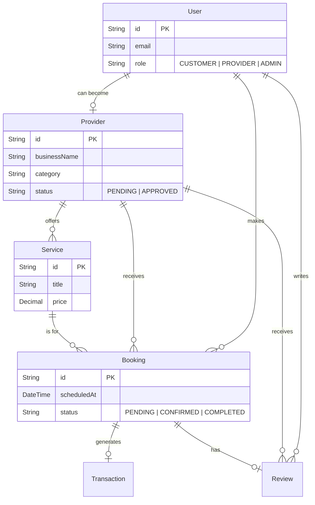

# Database Guide 🗄️

Welcome to the **Brain** of MH26 Services! 🧠
This document explains how we store and manage data. We use **PostgreSQL** (a powerful relational database) and **Prisma** (a super handy tool to talk to the database).

## 📊 Visual Schema (ER Diagram)

Here is a bird's-eye view of how our tables connect to each other:



## 🧱 The Building Blocks (Tables)

### 1. Users 👤
Stores everyone who interacts with the app.
- **`role`**: Defines what they can do.
    - `CUSTOMER`: The regular user looking for help.
    - `PROVIDER`: The skilled worker offering services.
    - `ADMIN`: The boss managing the platform.

### 2. Providers 🛠️
When a user wants to work, they get a "Provider" profile linked to their account.
- **`businessName`**: What shows up on their card.
- **`gallery`**: A list of photo URLs showing off their work.
- **`status`**:
    - `PENDING`: Waiting for admin approval.
    - `APPROVED`: Live and ready to get bookings!
    - `REJECTED`: Something was wrong with the application.

### 3. Services 📋
The actual jobs a provider offers (e.g., "Tap Repair", "Full House Wiring").
- **`price`**: Cost of the service.
- **`durationMin`**: Estimated time to finish.

### 4. Bookings 📅
The connection between a Customer and a Provider.
- **`status`**:
    - `PENDING`: Waiting for provider to accept.
    - `CONFIRMED`: It's on!
    - `COMPLETED`: Job done.
    - `CANCELLED`: Didn't happen.

## 📝 Exploring Data

Want to peek inside the database without writing SQL? Use **Prisma Studio**!

1.  Open your terminal.
2.  Run:
    ```bash
    npx prisma studio
    ```
3.  Go to `http://localhost:5555` in your browser. It's like a spreadsheet for your DB!

## 🔄 Resetting the World (Seeding)

If you messed up the data or just want a fresh start with cool fake data:

```bash
cd server
npm run seed
```

> [!WARNING]
> This will **DELETE** all existing data and replace it with fresh seed data. Be careful!
