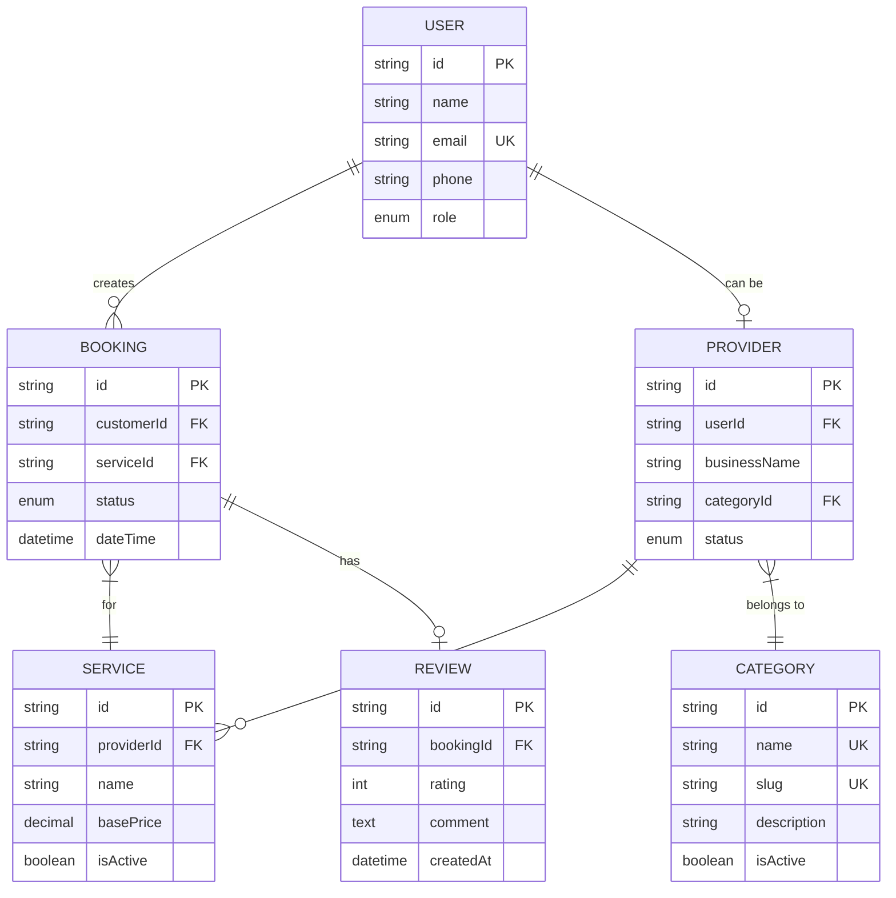

# MH26 Services - Simple ER Diagram (Mermaid)

## Cardinalities Explained

| Relationship | Cardinality | Meaning |
|--------------|-------------|---------|
| USER → BOOKING | 1:N | One user can create many bookings |
| USER → PROVIDER | 1:0..1 | One user can optionally be one provider |
| PROVIDER → SERVICE | 1:N | One provider can offer many services |
| PROVIDER → CATEGORY | N:1 | Many providers belong to one category |
| BOOKING → SERVICE | N:1 | Many bookings are for one service |
| BOOKING → REVIEW | 1:0..1 | One booking can optionally have one review |
