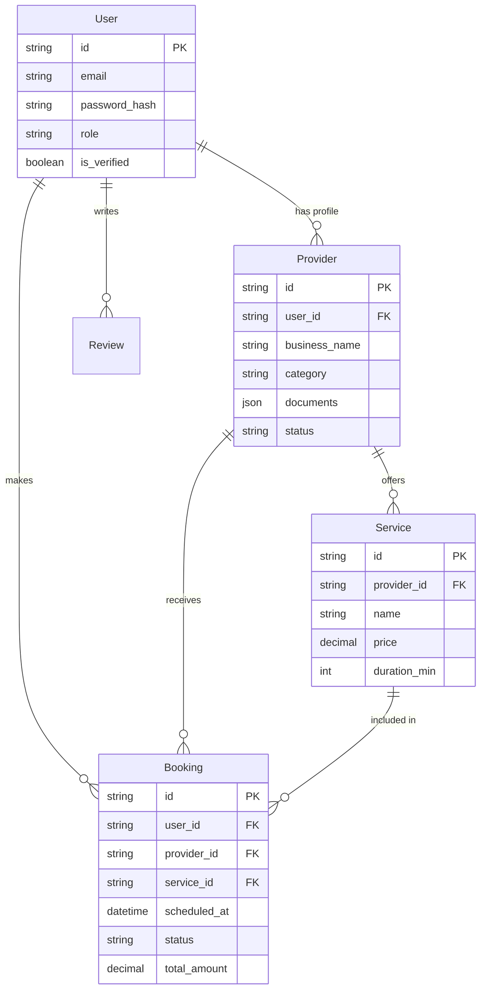
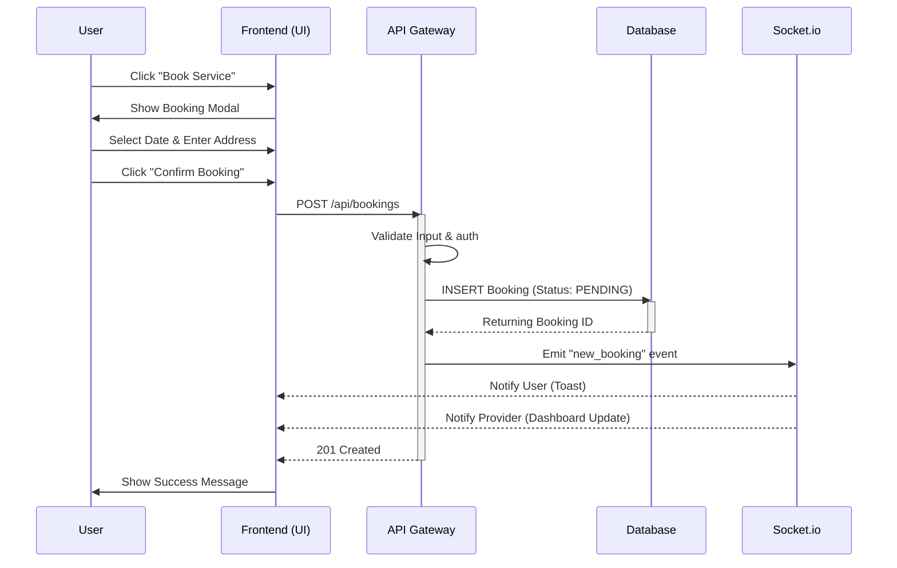
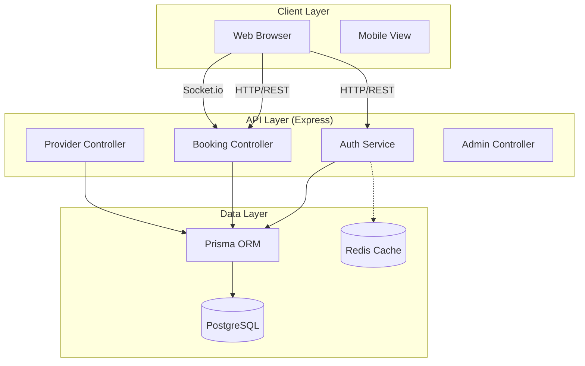
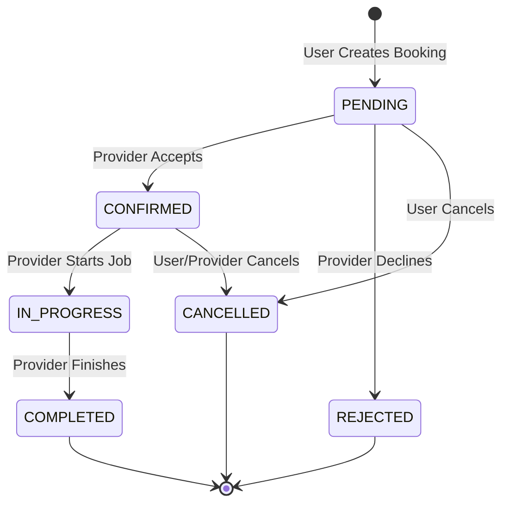

# System Unified Modeling Language (UML) Diagrams

## 1. Entity Relationship Diagram (ERD)
Represents the database schema and relationships between Users, Providers, Services, and Bookings.

## 2. Sequence Diagram: Booking Flow
Illustrates the interaction between the User, Frontend, Backend, and Database during a service booking.

## 3. Component Diagram
High-level architectural view of the system components.

## 4. State Diagram: Booking Lifecycle
Tracks the possible states of a booking from creation to completion.

