# UML Diagrams for MH26 Services Marketplace

This document contains all UML diagrams for the MH26 Services platform.

---

## Table of Contents

1. [Use Case Diagram](#1-use-case-diagram)
2. [Class Diagram](#2-class-diagram)
3. [Object Diagram](#3-object-diagram)
4. [Sequence Diagrams](#4-sequence-diagrams)
5. [Activity Diagrams](#5-activity-diagrams)
6. [State Diagram](#6-state-diagram)
7. [Component Diagram](#7-component-diagram)
8. [Deployment Diagram](#8-deployment-diagram)
9. [Database Schema (ER Diagram)](#9-database-schema-er-diagram)

---

## 1. Use Case Diagram

### 1.1 Main Use Case Diagram

```mermaid
graph TB
    %% Styling
    classDef actorStyle fill:#4A90E2,stroke:#2E5C8A,stroke-width:3px,color:#fff,font-weight:bold
    classDef customerUC fill:#E8F5E9,stroke:#4CAF50,stroke-width:2px
    classDef providerUC fill:#FFF3E0,stroke:#FF9800,stroke-width:2px
    classDef adminUC fill:#F3E5F5,stroke:#9C27B0,stroke-width:2px
    classDef systemUC fill:#E1F5FE,stroke:#00BCD4,stroke-width:2px
    
    %% Actors
    Customer((Customer))
    Provider((Service Provider))
    Admin((Administrator))
    System((System))
    
    %% Customer Use Cases
    UC1[Register Account]
    UC2[Login/Logout]
    UC3[Search Services]
    UC4[View Provider Details]
    UC5[Create Booking Request]
    UC6[Send Message]
    UC7[Submit Review]
    UC8[Report Provider]
    UC9[View Notifications]
    UC10[Cancel Booking]
    
    %% Provider Use Cases
    UC11[Register Provider Profile]
    UC12[Upload Documents]
    UC13[Create Service Listing]
    UC14[View Booking Requests]
    UC15[Accept Booking]
    UC16[Reject Booking]
    UC17[Complete Booking]
    UC18[Update Profile]
    
    %% Admin Use Cases
    UC19[Approve Provider]
    UC20[Reject Provider]
    UC21[Manage Users]
    UC22[View Analytics]
    UC23[Handle Reports]
    UC24[Configure Settings]
    
    %% System Use Cases
    UC25[Send Email Verification]
    UC26[Send Email OTP]
    UC27[Generate Invoice]
    UC28[Calculate Platform Fee]
    UC29[Update Provider Rating]
    UC30[Send Booking Notifications]
    
    %% Customer Relationships
    Customer --> UC1
    Customer --> UC2
    Customer --> UC3
    Customer --> UC4
    Customer --> UC5
    Customer --> UC6
    Customer --> UC7
    Customer --> UC8
    Customer --> UC9
    Customer --> UC10
    
    %% Provider Relationships
    Provider --> UC11
    Provider --> UC12
    Provider --> UC13
    Provider --> UC14
    Provider --> UC15
    Provider --> UC16
    Provider --> UC17
    Provider --> UC18
    
    %% Admin Relationships
    Admin --> UC19
    Admin --> UC20
    Admin --> UC21
    Admin --> UC22
    Admin --> UC23
    Admin --> UC24
    
    %% System Relationships
    System --> UC25
    System --> UC26
    System --> UC27
    System --> UC28
    System --> UC29
    System --> UC30
    
    %% Include Relationships (dashed)
    UC1 -.->|includes| UC25
    UC1 -.->|includes| UC26
    UC5 -.->|includes| UC30
    UC5 -.->|includes| UC28
    UC7 -.->|includes| UC29
    UC11 -.->|includes| UC12
    UC15 -.->|includes| UC30
    UC16 -.->|includes| UC30
    
    %% Extend Relationships (dashed)
    UC19 -.->|extends| UC18
    UC20 -.->|extends| UC18
    
    %% Apply Styles
    class Customer,Provider,Admin,System actorStyle
    class UC1,UC2,UC3,UC4,UC5,UC6,UC7,UC8,UC9,UC10 customerUC
    class UC11,UC12,UC13,UC14,UC15,UC16,UC17,UC18 providerUC
    class UC19,UC20,UC21,UC22,UC23,UC24 adminUC
    class UC25,UC26,UC27,UC28,UC29,UC30 systemUC
```

### 1.2 Detailed Use Case Descriptions

#### Customer Use Cases

**UC-1: Register Account**
- **Actor**: Customer
- **Description**: Customer creates a new account with email, phone, and password
- **Preconditions**: None
- **Postconditions**: Account created, verification email sent
- **Main Flow**:
  1. Customer enters registration details
  2. System validates input
  3. System creates user account
  4. System sends verification email
  5. System returns success message

**UC-3: Search Services**
- **Actor**: Customer
- **Description**: Customer searches for service providers by category, location, or keyword
- **Preconditions**: None
- **Postconditions**: Search results displayed
- **Main Flow**:
  1. Customer enters search criteria
  2. System queries database
  3. System returns matching providers
  4. Customer views results

**UC-5: Create Booking Request**
- **Actor**: Customer
- **Description**: Customer creates a booking request for a service
- **Preconditions**: Customer must be logged in, service must exist, provider must be approved
- **Postconditions**: Booking created with PENDING status, provider notified
- **Main Flow**:
  1. Customer selects service
  2. Customer selects date/time
  3. Customer enters address and requirements
  4. System calculates total amount and platform fee
  5. System creates booking with PENDING status
  6. System creates notification for provider
  7. System emits real-time notification via Socket.io
  8. System returns booking details to customer

---

## 2. Class Diagram

### 2.1 Main Class Diagram

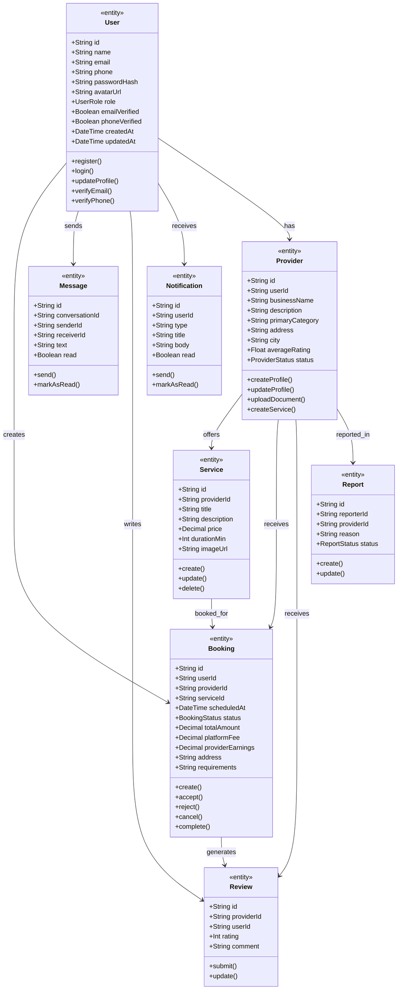

### 2.2 Controller Classes

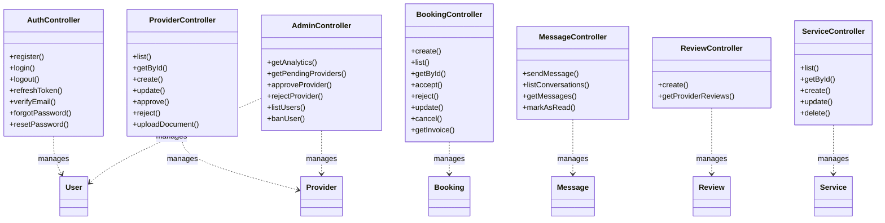

### 2.3 Service Classes

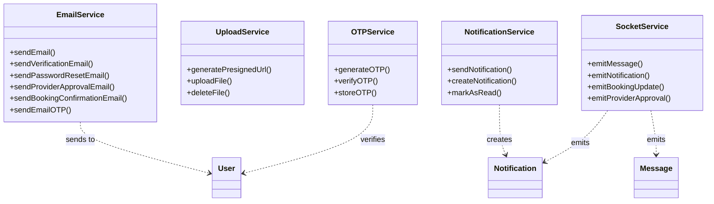

---

## 3. Object Diagram

### 3.1 Booking Creation Object Diagram

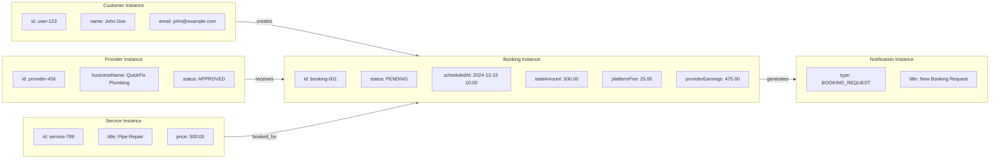

### 3.2 Provider Approval Object Diagram

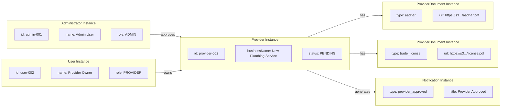

---

## 4. Sequence Diagrams

### 4.1 User Registration Sequence Diagram

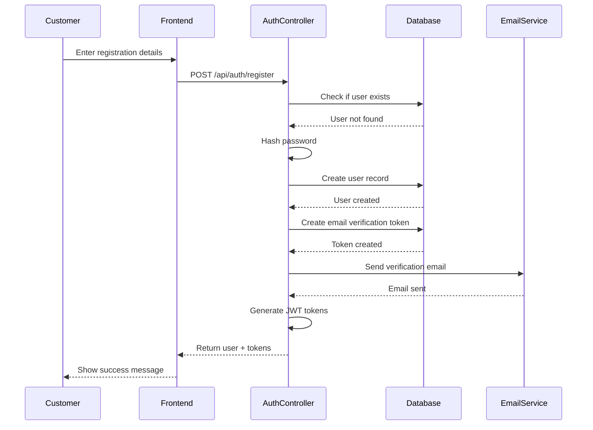

### 4.2 Booking Creation and Acceptance Sequence Diagram

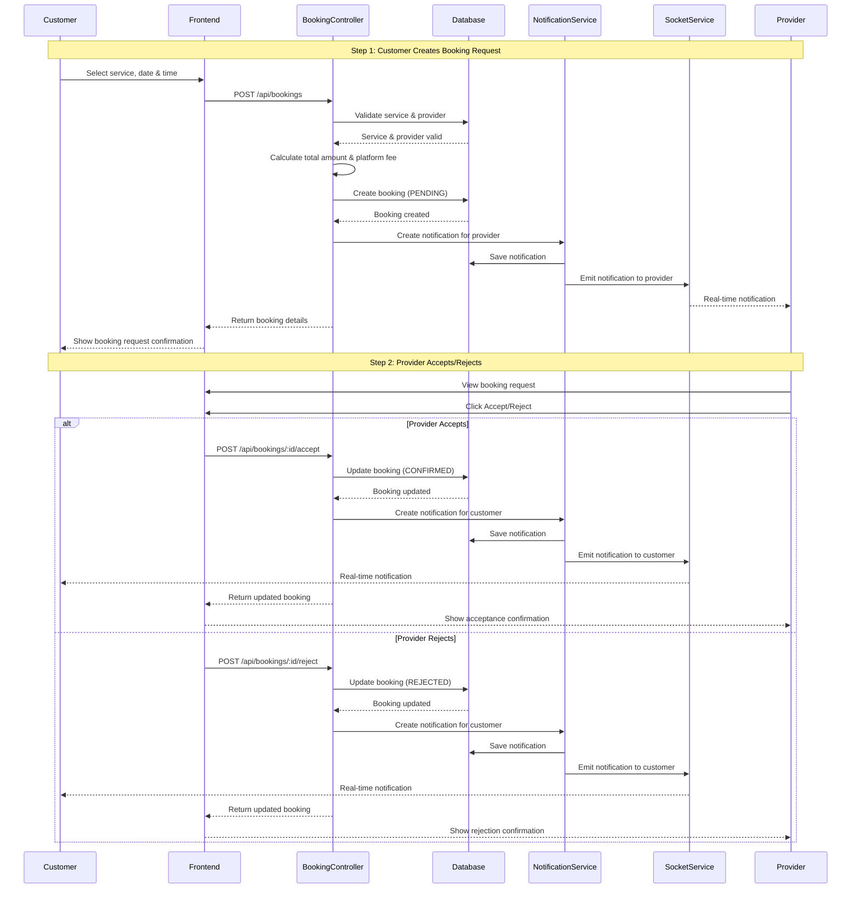

### 4.3 Provider Approval Sequence Diagram

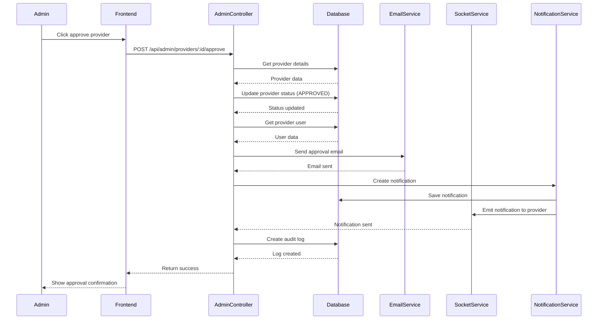

### 4.4 Message Sending Sequence Diagram

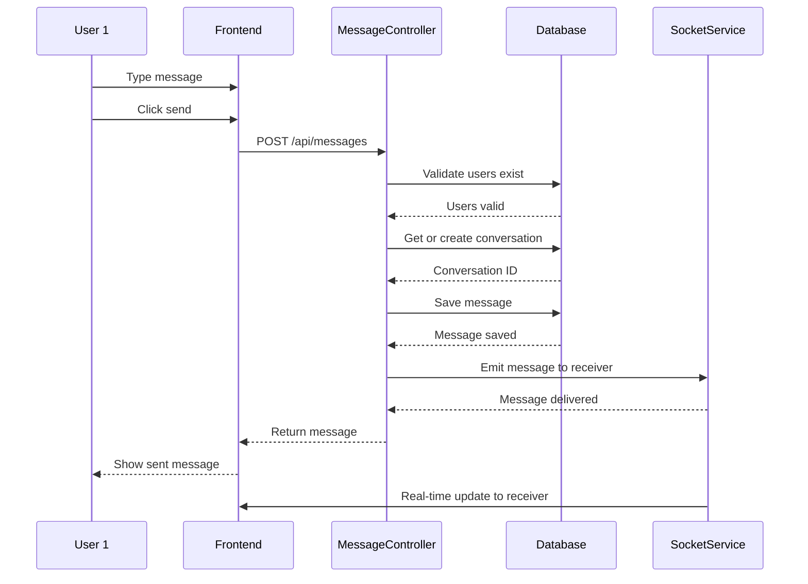

### 4.5 Provider Accept/Reject Booking Sequence Diagram

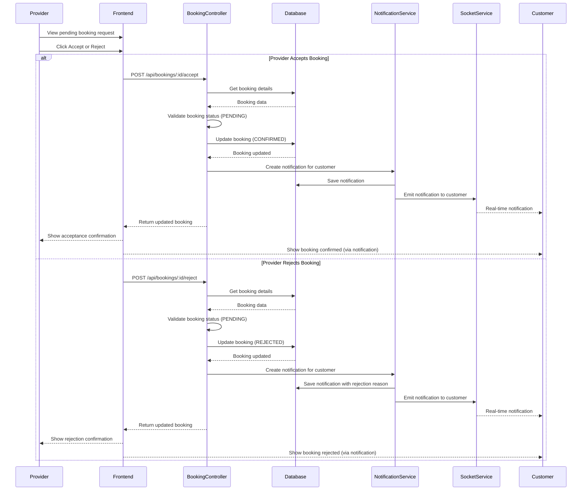

### 4.6 Review Submission Sequence Diagram

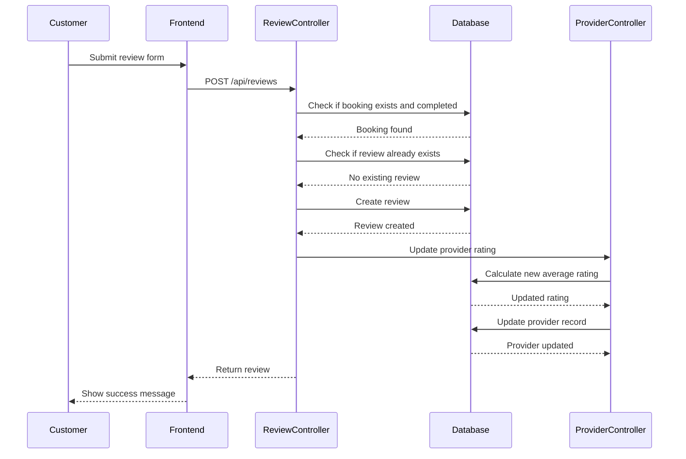

---

## 5. Activity Diagrams

### 5.1 Provider Onboarding Activity Diagram

### 5.2 Booking Flow Activity Diagram

---

## 6. State Diagram

### 6.1 Booking State Diagram

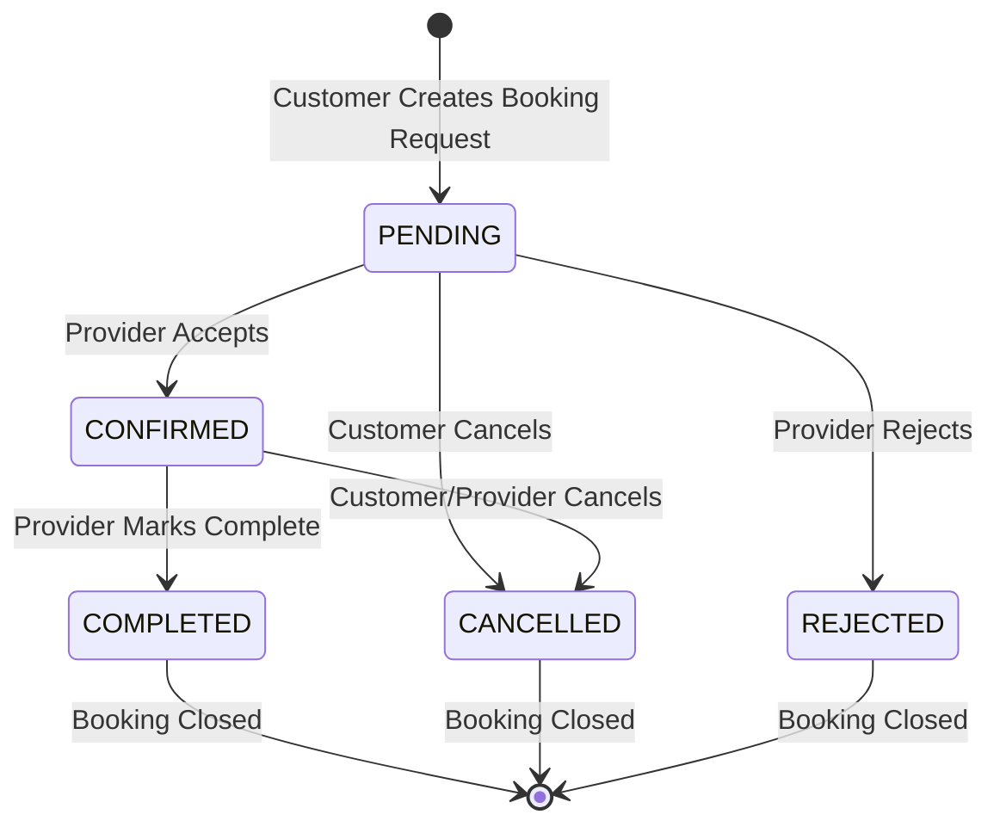

### 6.2 Provider Status State Diagram

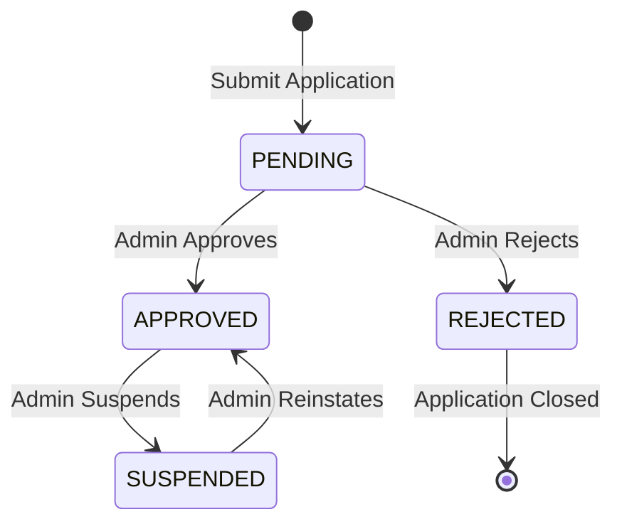

---

## 7. Component Diagram

### 7.1 System Architecture Component Diagram

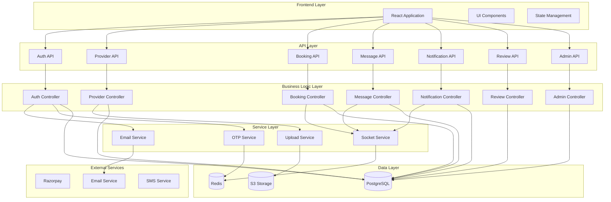

---

## 8. Deployment Diagram

### 8.1 System Deployment Diagram

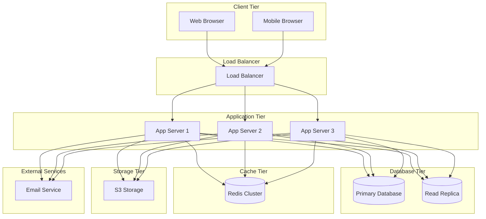

---

## 9. Database Schema (ER Diagram)

### 9.1 Entity Relationship Diagram

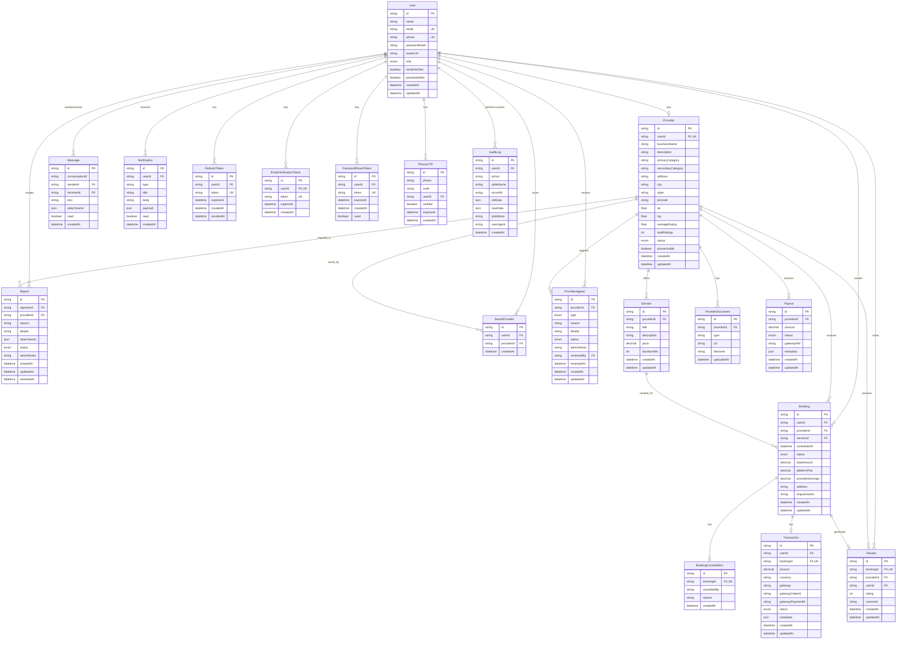

### 9.2 Database Schema Details

#### Core Models

**User Model**
- Primary Key: `id` (UUID)
- Unique Constraints: `email`, `phone`
- Indexes: `email`, `phone`, `role`
- Relationships:
  - One-to-Many: Bookings, Messages, Reviews, Notifications, Reports
  - One-to-One: Provider (optional)
  - One-to-Many: RefreshTokens, EmailVerificationToken, PasswordResetTokens, PhoneOTPs

**Provider Model**
- Primary Key: `id` (UUID)
- Foreign Key: `userId` (unique, references User)
- Indexes: `city + primaryCategory`, `status`, `userId`, `lat + lng`
- Relationships:
  - Many-to-One: User
  - One-to-Many: Services, Bookings, Reviews, Documents, Payouts, Appeals

**Booking Model**
- Primary Key: `id` (UUID)
- Foreign Keys: `userId`, `providerId`, `serviceId`
- Indexes: `userId + status`, `providerId + scheduledAt`, `status`, `scheduledAt`
- Status Enum: `PENDING`, `CONFIRMED`, `COMPLETED`, `CANCELLED`, `REJECTED`
- Relationships:
  - Many-to-One: User, Provider, Service
  - One-to-One: BookingCancellation, Transaction, Review (optional)

**Service Model**
- Primary Key: `id` (UUID)
- Foreign Key: `providerId`
- Index: `providerId`
- Relationships:
  - Many-to-One: Provider
  - One-to-Many: Bookings

**Message Model**
- Primary Key: `id` (UUID)
- Foreign Keys: `senderId`, `receiverId`
- Indexes: `conversationId + createdAt`, `senderId`, `receiverId`, `read`
- Relationships:
  - Many-to-One: User (as sender and receiver)

**Notification Model**
- Primary Key: `id` (UUID)
- Foreign Key: `userId`
- Indexes: `userId + read + createdAt`, `type`
- Relationships:
  - Many-to-One: User

**Review Model**
- Primary Key: `id` (UUID)
- Foreign Keys: `providerId`, `userId`, `bookingId` (unique, optional)
- Indexes: `providerId`, `userId`, `rating`
- Relationships:
  - Many-to-One: Provider, User
  - One-to-One: Booking (optional)

**Report Model**
- Primary Key: `id` (UUID)
- Foreign Keys: `reporterId`, `providerId`
- Status Enum: `OPEN`, `INVESTIGATING`, `RESOLVED`, `DISMISSED`
- Indexes: `providerId`, `status`, `reporterId`
- Relationships:
  - Many-to-One: User (reporter), Provider

#### Authentication & Security Models

**RefreshToken Model**
- Primary Key: `id` (UUID)
- Foreign Key: `userId`
- Unique: `token`
- Indexes: `userId`, `token`, `expiresAt`

**EmailVerificationToken Model**
- Primary Key: `id` (UUID)
- Foreign Key: `userId` (unique)
- Unique: `token`
- Indexes: `token`, `expiresAt`

**PasswordResetToken Model**
- Primary Key: `id` (UUID)
- Foreign Key: `userId`
- Unique: `token`
- Indexes: `token`, `expiresAt`, `userId`

**PhoneOTP Model**
- Primary Key: `id` (UUID)
- Foreign Key: `userId` (optional)
- Indexes: `phone`, `code`, `userId`, `expiresAt`

#### Supporting Models

**ProviderDocument Model**
- Primary Key: `id` (UUID)
- Foreign Key: `providerId`
- Index: `providerId`
- Document types: `aadhar`, `trade_license`, `gst`, `shop_photo`, etc.

**BookingCancellation Model**
- Primary Key: `id` (UUID)
- Foreign Key: `bookingId` (unique)
- Stores cancellation reason and who cancelled

**Transaction Model**
- Primary Key: `id` (UUID)
- Foreign Keys: `userId`, `bookingId` (unique, optional)
- Status Enum: `PENDING`, `SUCCESS`, `FAILED`, `REFUNDED`
- Indexes: `userId`, `bookingId`, `status`, `gatewayOrderId`
- Note: Payment integration not yet implemented

**ProviderAppeal Model**
- Primary Key: `id` (UUID)
- Foreign Keys: `providerId`, `reviewedBy` (optional)
- Type Enum: `UNBAN_REQUEST`, `REJECTION_APPEAL`, `SUSPENSION_APPEAL`, `OTHER`
- Status Enum: `PENDING`, `APPROVED`, `REJECTED`, `UNDER_REVIEW`
- Indexes: `providerId`, `status`, `type`

**Payout Model**
- Primary Key: `id` (UUID)
- Foreign Key: `providerId`
- Status Enum: `PENDING`, `PROCESSING`, `COMPLETED`, `FAILED`
- Indexes: `providerId`, `status`

**SavedProvider Model**
- Primary Key: `id` (UUID)
- Foreign Keys: `userId`, `providerId`
- Unique Constraint: `userId + providerId`
- Index: `userId`

**AuditLog Model**
- Primary Key: `id` (UUID)
- Foreign Key: `userId` (optional)
- Indexes: `userId`, `tableName + recordId`, `createdAt`
- Stores all admin actions and changes

### 9.3 Enums

**UserRole**
- `CUSTOMER` - Regular customer user
- `PROVIDER` - Service provider user
- `ADMIN` - Administrator user

**ProviderStatus**
- `PENDING` - Application submitted, awaiting review
- `APPROVED` - Application approved, provider active
- `REJECTED` - Application rejected
- `SUSPENDED` - Provider temporarily suspended

**BookingStatus**
- `PENDING` - Booking request created, awaiting provider response
- `CONFIRMED` - Provider accepted the booking
- `COMPLETED` - Service completed by provider
- `CANCELLED` - Booking cancelled by customer or provider
- `REJECTED` - Booking rejected by provider

**TransactionStatus**
- `PENDING` - Transaction initiated
- `SUCCESS` - Payment successful
- `FAILED` - Payment failed
- `REFUNDED` - Payment refunded

**ReportStatus**
- `OPEN` - Report submitted
- `INVESTIGATING` - Under investigation
- `RESOLVED` - Issue resolved
- `DISMISSED` - Report dismissed

**AppealType**
- `UNBAN_REQUEST` - Request to unban account
- `REJECTION_APPEAL` - Appeal against rejection
- `SUSPENSION_APPEAL` - Appeal against suspension
- `OTHER` - Other appeal types

**AppealStatus**
- `PENDING` - Appeal submitted
- `APPROVED` - Appeal approved
- `REJECTED` - Appeal rejected
- `UNDER_REVIEW` - Under review

**PayoutStatus**
- `PENDING` - Payout requested
- `PROCESSING` - Payout being processed
- `COMPLETED` - Payout completed
- `FAILED` - Payout failed

### 9.4 Key Relationships Summary

1. **User ↔ Provider**: One-to-One (optional) - A user can have one provider profile
2. **User ↔ Booking**: One-to-Many - A user can create multiple bookings
3. **Provider ↔ Service**: One-to-Many - A provider can offer multiple services
4. **Service ↔ Booking**: One-to-Many - A service can be booked multiple times
5. **Booking ↔ Review**: One-to-One (optional) - A booking can have one review
6. **User ↔ Message**: One-to-Many (as sender and receiver) - Users can send/receive messages
7. **Provider ↔ Review**: One-to-Many - A provider can receive multiple reviews
8. **User ↔ Notification**: One-to-Many - A user can receive multiple notifications
9. **Provider ↔ Report**: One-to-Many - A provider can be reported multiple times

---

**Document Status**: Complete  
**Last Updated**: January 2025  
**Version**: 1.1

