# UML Diagrams for MH26 Services Marketplace

This document contains all UML diagrams for the MH26 Services platform.

---

## Table of Contents

1. [Use Case Diagram](#1-use-case-diagram)
2. [Class Diagram](#2-class-diagram)
3. [Object Diagram](#3-object-diagram)
4. [Sequence Diagrams](#4-sequence-diagrams)

---

## 1. Use Case Diagram

### 1.1 Main Use Case Diagram

```mermaid
graph TB
    %% Actors
    Customer[Customer]
    Provider[Service Provider]
    Admin[Administrator]
    System[System]
    
    %% Customer Use Cases
    Customer --> UC1[Register Account]
    Customer --> UC2[Login/Logout]
    Customer --> UC3[Search Services]
    Customer --> UC4[View Provider Details]
    Customer --> UC5[Create Booking Request]
    Customer --> UC6[Send Message]
    Customer --> UC7[Submit Review]
    Customer --> UC8[Report Provider]
    Customer --> UC9[View Notifications]
    Customer --> UC10[Cancel Booking]
    
    %% Provider Use Cases
    Provider --> UC11[Register Provider Profile]
    Provider --> UC12[Upload Documents]
    Provider --> UC13[Create Service Listing]
    Provider --> UC14[View Booking Requests]
    Provider --> UC15[Accept Booking]
    Provider --> UC16[Reject Booking]
    Provider --> UC17[Complete Booking]
    Provider --> UC18[Update Profile]
    
    %% Admin Use Cases
    Admin --> UC19[Approve Provider]
    Admin --> UC20[Reject Provider]
    Admin --> UC21[Manage Users]
    Admin --> UC22[View Analytics]
    Admin --> UC23[Handle Reports]
    Admin --> UC24[Configure Settings]
    
    %% System Use Cases
    System --> UC25[Send Email Verification]
    System --> UC26[Send Email OTP]
    System --> UC27[Generate Invoice]
    System --> UC28[Calculate Platform Fee]
    System --> UC29[Update Provider Rating]
    System --> UC30[Send Booking Notifications]
    
    %% Relationships
    UC1 -.->|includes| UC25
    UC1 -.->|includes| UC26
    UC5 -.->|includes| UC30
    UC5 -.->|includes| UC28
    UC7 -.->|includes| UC29
    UC11 -.->|includes| UC12
    UC15 -.->|includes| UC30
    UC16 -.->|includes| UC30
    UC19 -.->|extends| UC18
    UC20 -.->|extends| UC18
```

### 1.2 Detailed Use Case Descriptions

#### Customer Use Cases

**UC-1: Register Account**
- **Actor**: Customer
- **Description**: Customer creates a new account with email, phone, and password
- **Preconditions**: None
- **Postconditions**: Account created, verification email sent
- **Main Flow**:
  1. Customer enters registration details
  2. System validates input
  3. System creates user account
  4. System sends verification email
  5. System returns success message

**UC-3: Search Services**
- **Actor**: Customer
- **Description**: Customer searches for service providers by category, location, or keyword
- **Preconditions**: None
- **Postconditions**: Search results displayed
- **Main Flow**:
  1. Customer enters search criteria
  2. System queries database
  3. System returns matching providers
  4. Customer views results

**UC-5: Create Booking Request**
- **Actor**: Customer
- **Description**: Customer creates a booking request for a service
- **Preconditions**: Customer must be logged in, service must exist, provider must be approved
- **Postconditions**: Booking created with PENDING status, provider notified
- **Main Flow**:
  1. Customer selects service
  2. Customer selects date/time
  3. Customer enters address and requirements
  4. System calculates total amount and platform fee
  5. System creates booking with PENDING status
  6. System creates notification for provider
  7. System emits real-time notification via Socket.io
  8. System returns booking details to customer

---

## 2. Class Diagram

### 2.1 Main Class Diagram


### 2.2 Controller Classes

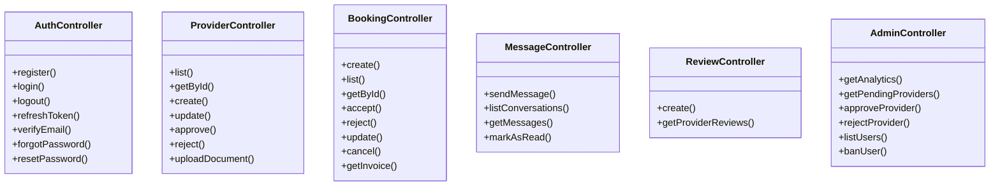

### 2.3 Service Classes

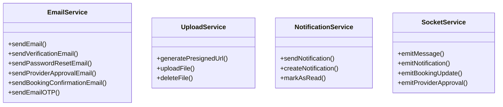

---

## 3. Object Diagram

### 3.1 Booking Creation Object Diagram

```mermaid
objectDiagram
    customer1 : Customer
    customer1 : id = "user-123"
    customer1 : name = "John Doe"
    customer1 : email = "john@example.com"
    
    provider1 : Provider
    provider1 : id = "provider-456"
    provider1 : businessName = "QuickFix Plumbing"
    provider1 : status = APPROVED
    
    service1 : Service
    service1 : id = "service-789"
    service1 : title = "Pipe Repair"
    service1 : price = 500.00
    
    booking1 : Booking
    booking1 : id = "booking-001"
    booking1 : status = PENDING
    booking1 : scheduledAt = "2024-12-15 10:00"
    booking1 : totalAmount = 500.00
    booking1 : platformFee = 25.00
    booking1 : providerEarnings = 475.00
    
    notification1 : Notification
    notification1 : type = "BOOKING_REQUEST"
    notification1 : title = "New Booking Request"
    
    customer1 --> booking1 : creates
    provider1 --> booking1 : receives
    service1 --> booking1 : booked_for
    booking1 --> notification1 : generates
```

### 3.2 Provider Approval Object Diagram

```mermaid
objectDiagram
    admin1 : Administrator
    admin1 : id = "admin-001"
    admin1 : name = "Admin User"
    admin1 : role = ADMIN
    
    provider2 : Provider
    provider2 : id = "provider-002"
    provider2 : businessName = "New Plumbing Service"
    provider2 : status = PENDING
    
    user2 : User
    user2 : id = "user-002"
    user2 : name = "Provider Owner"
    user2 : role = PROVIDER
    
    doc1 : ProviderDocument
    doc1 : type = "aadhar"
    doc1 : url = "https://s3.../aadhar.pdf"
    
    doc2 : ProviderDocument
    doc2 : type = "trade_license"
    doc2 : url = "https://s3.../license.pdf"
    
    notification1 : Notification
    notification1 : type = "provider_approved"
    notification1 : title = "Provider Approved"
    
    admin1 --> provider2 : approves
    user2 --> provider2 : owns
    provider2 --> doc1 : has
    provider2 --> doc2 : has
    provider2 --> notification1 : generates
```

---

## 4. Sequence Diagrams

### 4.1 User Registration Sequence Diagram

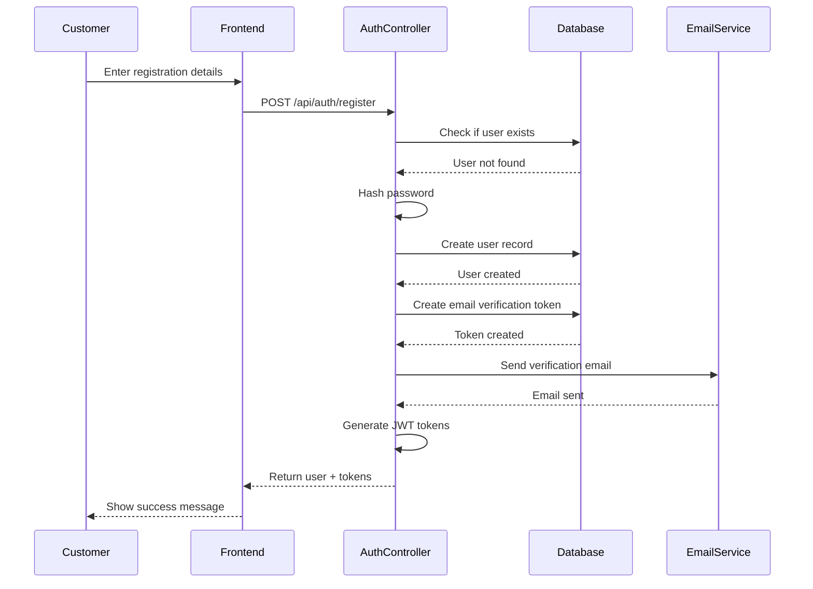

### 4.2 Booking Creation and Acceptance Sequence Diagram

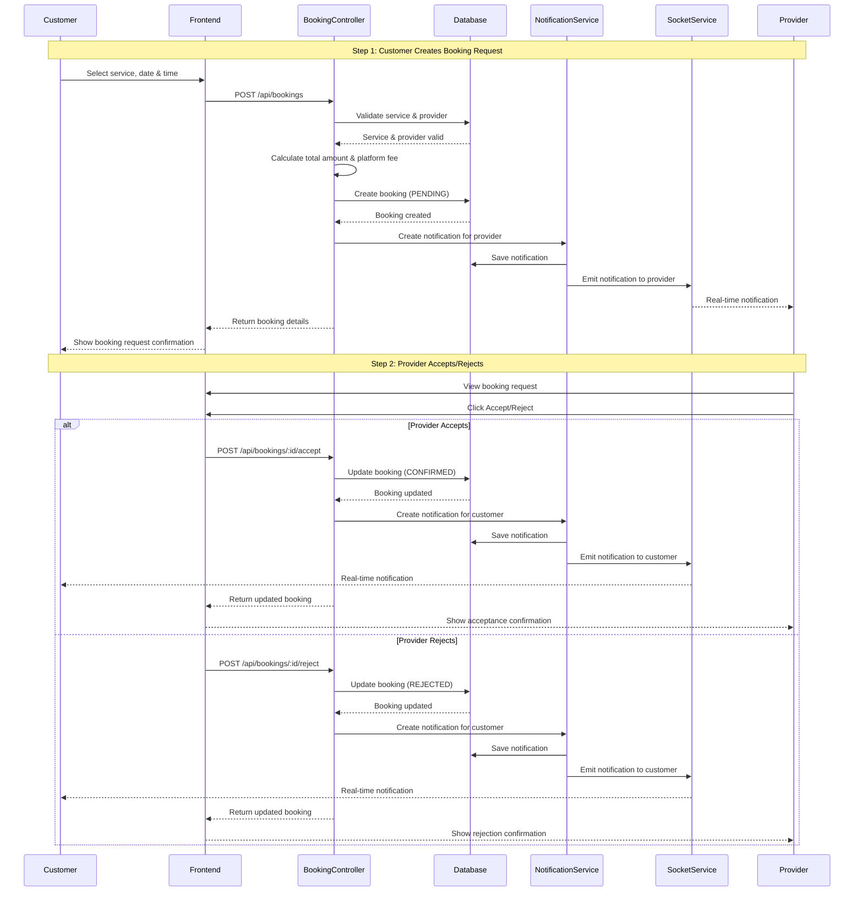

### 4.3 Provider Approval Sequence Diagram

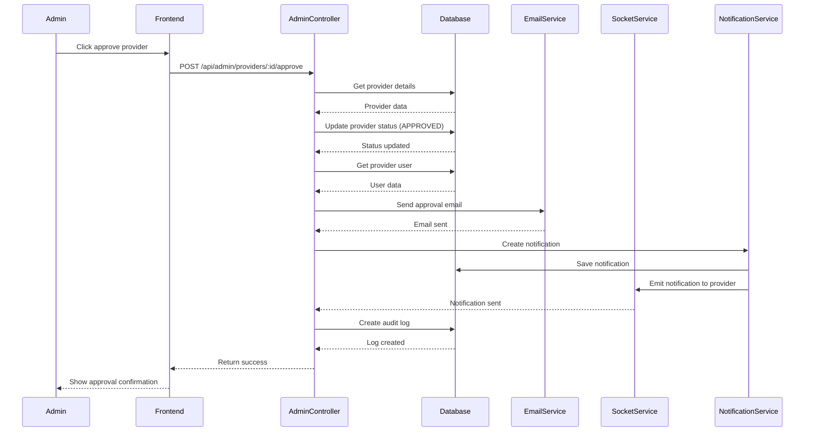

### 4.4 Message Sending Sequence Diagram

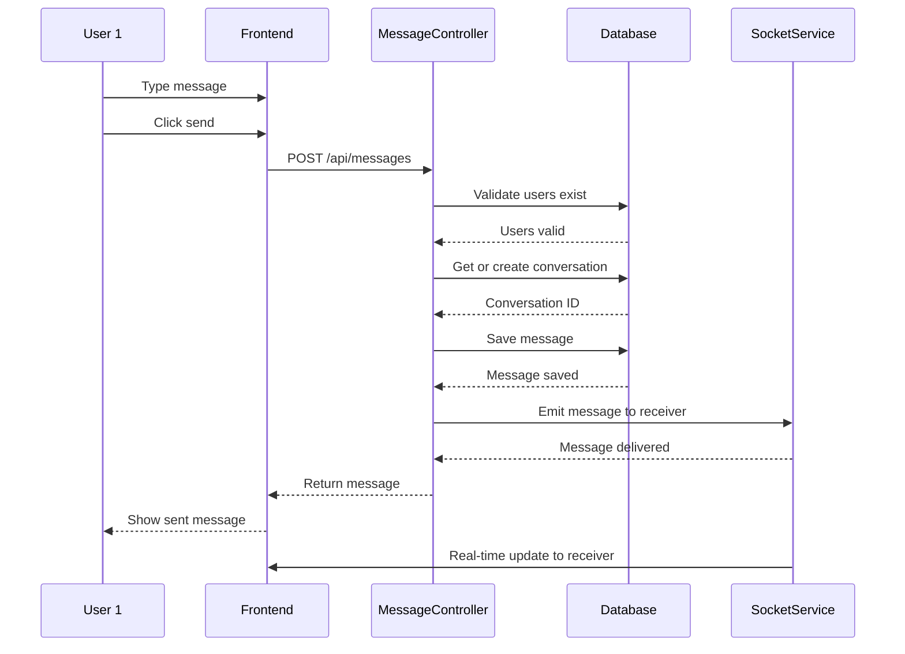

### 4.5 Provider Accept/Reject Booking Sequence Diagram

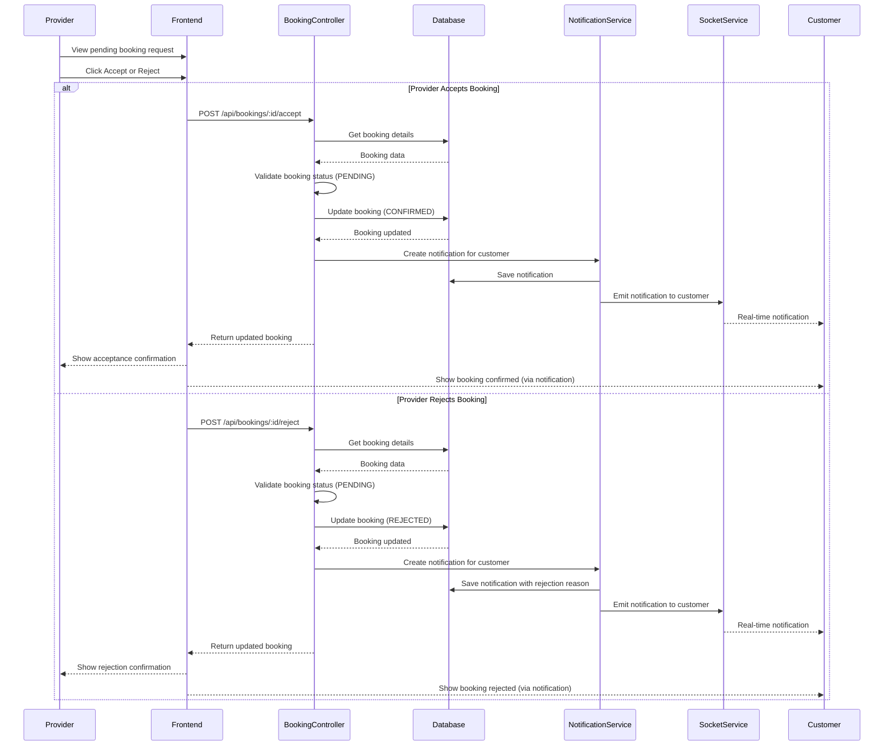

### 4.6 Review Submission Sequence Diagram

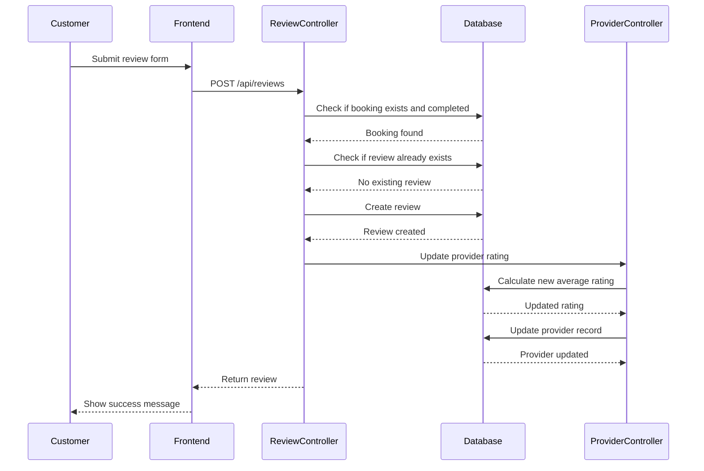

---

## 5. Activity Diagrams

### 5.1 Provider Onboarding Activity Diagram


### 5.2 Booking Flow Activity Diagram


---

## 6. State Diagram

### 6.1 Booking State Diagram

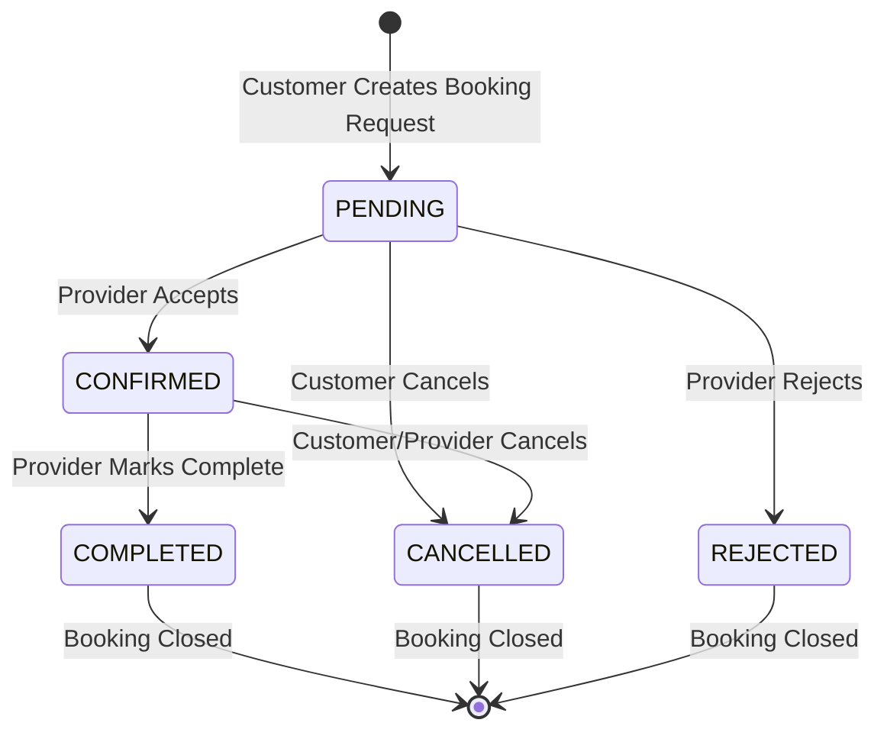

### 6.2 Provider Status State Diagram

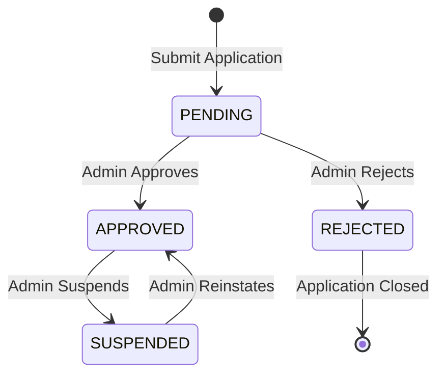

---

## 7. Component Diagram

### 7.1 System Architecture Component Diagram

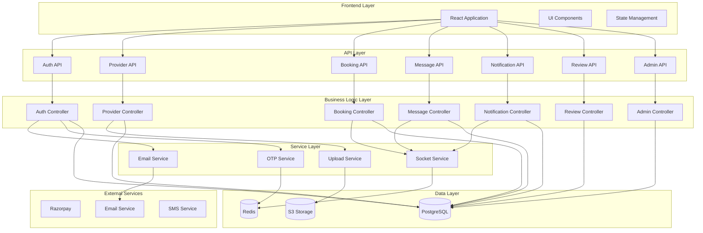

---

## 8. Deployment Diagram

### 8.1 System Deployment Diagram

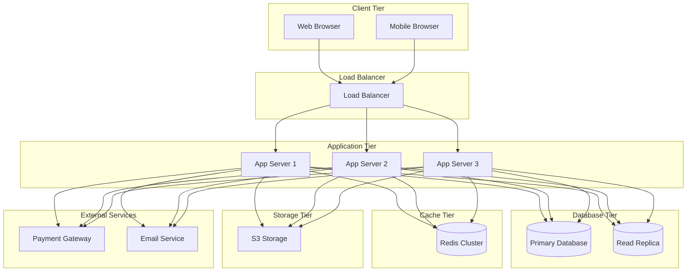

---

**Document Status**: Complete  
**Last Updated**: 2024  
**Version**: 1.0


