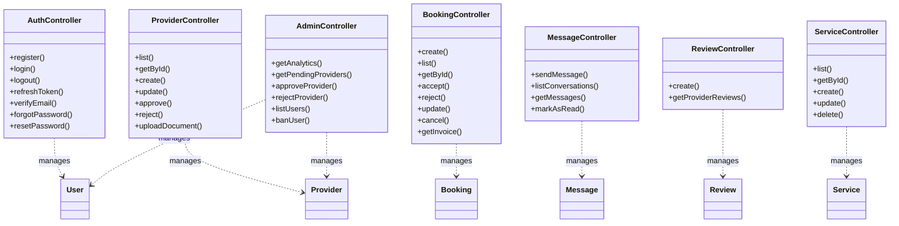

# UML Diagrams for MH26 Services Marketplace

This document contains all UML diagrams for the MH26 Services platform.

---

## Table of Contents

1. [Use Case Diagram](#1-use-case-diagram)
2. [Class Diagram](#2-class-diagram)
3. [Object Diagram](#3-object-diagram)
4. [Sequence Diagrams](#4-sequence-diagrams)
5. [Activity Diagrams](#5-activity-diagrams)
6. [State Diagram](#6-state-diagram)
7. [Component Diagram](#7-component-diagram)
8. [Deployment Diagram](#8-deployment-diagram)
9. [Database Schema (ER Diagram)](#9-database-schema-er-diagram)
10. [Package Diagram](#10-package-diagram)
11. [Communication Diagram](#11-communication-diagram)
12. [Collaboration Diagrams](#12-collaboration-diagrams)
13. [Simplified Diagrams for Academic Reports](#13-simplified-diagrams-for-academic-reports)

---

## 1. Use Case Diagram

### 1.1 Main Use Case Diagram


### 1.2 Detailed Use Case Descriptions

#### Customer Use Cases

**UC-1: Register Account**
- **Actor**: Customer
- **Description**: Customer creates a new account with email, phone, and password
- **Preconditions**: None
- **Postconditions**: Account created, verification email sent
- **Main Flow**:
  1. Customer enters registration details
  2. System validates input
  3. System creates user account
  4. System sends verification email
  5. System returns success message

**UC-3: Search Services**
- **Actor**: Customer
- **Description**: Customer searches for service providers by category, location, or keyword
- **Preconditions**: None
- **Postconditions**: Search results displayed
- **Main Flow**:
  1. Customer enters search criteria
  2. System queries database
  3. System returns matching providers
  4. Customer views results

**UC-5: Create Booking Request**
- **Actor**: Customer
- **Description**: Customer creates a booking request for a service
- **Preconditions**: Customer must be logged in, service must exist, provider must be approved
- **Postconditions**: Booking created with PENDING status, provider notified
- **Main Flow**:
  1. Customer selects service
  2. Customer selects date/time
  3. Customer enters address and requirements
  4. System calculates total amount and platform fee
  5. System creates booking with PENDING status
  6. System creates notification for provider
  7. System emits real-time notification via Socket.io
  8. System returns booking details to customer

---

## 2. Class Diagram

### 2.1 Main Class Diagram


### 2.2 Controller Classes



### 2.3 Service Classes


---

## 3. Object Diagram

### 3.1 Booking Creation Object Diagram


### 3.2 Provider Approval Object Diagram


---

## 4. Sequence Diagrams

### 4.1 User Registration Sequence Diagram


### 4.2 Booking Creation and Acceptance Sequence Diagram


### 4.3 Provider Approval Sequence Diagram


### 4.4 Message Sending Sequence Diagram


### 4.5 Provider Accept/Reject Booking Sequence Diagram


### 4.6 Review Submission Sequence Diagram


---

## 5. Activity Diagrams

### 5.1 Provider Onboarding Activity Diagram


### 5.2 Booking Flow Activity Diagram


---

## 6. State Diagram

### 6.1 Booking State Diagram


### 6.2 Provider Status State Diagram


---

## 7. Component Diagram

### 7.1 System Architecture Component Diagram


---

## 8. Deployment Diagram

### 8.1 System Deployment Diagram


---

## 9. Database Schema (ER Diagram)

### 9.1 Entity Relationship Diagram


### 9.2 Database Schema Details

#### Core Models

**User Model**
- Primary Key: `id` (UUID)
- Unique Constraints: `email`, `phone`
- Indexes: `email`, `phone`, `role`
- Relationships:
  - One-to-Many: Bookings, Messages, Reviews, Notifications, Reports
  - One-to-One: Provider (optional)
  - One-to-Many: RefreshTokens, EmailVerificationToken, PasswordResetTokens, PhoneOTPs

**Provider Model**
- Primary Key: `id` (UUID)
- Foreign Key: `userId` (unique, references User)
- Indexes: `city + primaryCategory`, `status`, `userId`, `lat + lng`
- Relationships:
  - Many-to-One: User
  - One-to-Many: Services, Bookings, Reviews, Documents, Payouts, Appeals

**Booking Model**
- Primary Key: `id` (UUID)
- Foreign Keys: `userId`, `providerId`, `serviceId`
- Indexes: `userId + status`, `providerId + scheduledAt`, `status`, `scheduledAt`
- Status Enum: `PENDING`, `CONFIRMED`, `COMPLETED`, `CANCELLED`, `REJECTED`
- Relationships:
  - Many-to-One: User, Provider, Service
  - One-to-One: BookingCancellation, Transaction, Review (optional)

**Service Model**
- Primary Key: `id` (UUID)
- Foreign Key: `providerId`
- Index: `providerId`
- Relationships:
  - Many-to-One: Provider
  - One-to-Many: Bookings

**Message Model**
- Primary Key: `id` (UUID)
- Foreign Keys: `senderId`, `receiverId`
- Indexes: `conversationId + createdAt`, `senderId`, `receiverId`, `read`
- Relationships:
  - Many-to-One: User (as sender and receiver)

**Notification Model**
- Primary Key: `id` (UUID)
- Foreign Key: `userId`
- Indexes: `userId + read + createdAt`, `type`
- Relationships:
  - Many-to-One: User

**Review Model**
- Primary Key: `id` (UUID)
- Foreign Keys: `providerId`, `userId`, `bookingId` (unique, optional)
- Indexes: `providerId`, `userId`, `rating`
- Relationships:
  - Many-to-One: Provider, User
  - One-to-One: Booking (optional)

**Report Model**
- Primary Key: `id` (UUID)
- Foreign Keys: `reporterId`, `providerId`
- Status Enum: `OPEN`, `INVESTIGATING`, `RESOLVED`, `DISMISSED`
- Indexes: `providerId`, `status`, `reporterId`
- Relationships:
  - Many-to-One: User (reporter), Provider

#### Authentication & Security Models

**RefreshToken Model**
- Primary Key: `id` (UUID)
- Foreign Key: `userId`
- Unique: `token`
- Indexes: `userId`, `token`, `expiresAt`

**EmailVerificationToken Model**
- Primary Key: `id` (UUID)
- Foreign Key: `userId` (unique)
- Unique: `token`
- Indexes: `token`, `expiresAt`

**PasswordResetToken Model**
- Primary Key: `id` (UUID)
- Foreign Key: `userId`
- Unique: `token`
- Indexes: `token`, `expiresAt`, `userId`

**PhoneOTP Model**
- Primary Key: `id` (UUID)
- Foreign Key: `userId` (optional)
- Indexes: `phone`, `code`, `userId`, `expiresAt`

#### Supporting Models

**ProviderDocument Model**
- Primary Key: `id` (UUID)
- Foreign Key: `providerId`
- Index: `providerId`
- Document types: `aadhar`, `trade_license`, `gst`, `shop_photo`, etc.

**BookingCancellation Model**
- Primary Key: `id` (UUID)
- Foreign Key: `bookingId` (unique)
- Stores cancellation reason and who cancelled

**Transaction Model**
- Primary Key: `id` (UUID)
- Foreign Keys: `userId`, `bookingId` (unique, optional)
- Status Enum: `PENDING`, `SUCCESS`, `FAILED`, `REFUNDED`
- Indexes: `userId`, `bookingId`, `status`, `gatewayOrderId`
- Note: Payment integration not yet implemented

**ProviderAppeal Model**
- Primary Key: `id` (UUID)
- Foreign Keys: `providerId`, `reviewedBy` (optional)
- Type Enum: `UNBAN_REQUEST`, `REJECTION_APPEAL`, `SUSPENSION_APPEAL`, `OTHER`
- Status Enum: `PENDING`, `APPROVED`, `REJECTED`, `UNDER_REVIEW`
- Indexes: `providerId`, `status`, `type`

**Payout Model**
- Primary Key: `id` (UUID)
- Foreign Key: `providerId`
- Status Enum: `PENDING`, `PROCESSING`, `COMPLETED`, `FAILED`
- Indexes: `providerId`, `status`

**SavedProvider Model**
- Primary Key: `id` (UUID)
- Foreign Keys: `userId`, `providerId`
- Unique Constraint: `userId + providerId`
- Index: `userId`

**AuditLog Model**
- Primary Key: `id` (UUID)
- Foreign Key: `userId` (optional)
- Indexes: `userId`, `tableName + recordId`, `createdAt`
- Stores all admin actions and changes

### 9.3 Enums

**UserRole**
- `CUSTOMER` - Regular customer user
- `PROVIDER` - Service provider user
- `ADMIN` - Administrator user

**ProviderStatus**
- `PENDING` - Application submitted, awaiting review
- `APPROVED` - Application approved, provider active
- `REJECTED` - Application rejected
- `SUSPENDED` - Provider temporarily suspended

**BookingStatus**
- `PENDING` - Booking request created, awaiting provider response
- `CONFIRMED` - Provider accepted the booking
- `COMPLETED` - Service completed by provider
- `CANCELLED` - Booking cancelled by customer or provider
- `REJECTED` - Booking rejected by provider

**TransactionStatus**
- `PENDING` - Transaction initiated
- `SUCCESS` - Payment successful
- `FAILED` - Payment failed
- `REFUNDED` - Payment refunded

**ReportStatus**
- `OPEN` - Report submitted
- `INVESTIGATING` - Under investigation
- `RESOLVED` - Issue resolved
- `DISMISSED` - Report dismissed

**AppealType**
- `UNBAN_REQUEST` - Request to unban account
- `REJECTION_APPEAL` - Appeal against rejection
- `SUSPENSION_APPEAL` - Appeal against suspension
- `OTHER` - Other appeal types

**AppealStatus**
- `PENDING` - Appeal submitted
- `APPROVED` - Appeal approved
- `REJECTED` - Appeal rejected
- `UNDER_REVIEW` - Under review

**PayoutStatus**
- `PENDING` - Payout requested
- `PROCESSING` - Payout being processed
- `COMPLETED` - Payout completed
- `FAILED` - Payout failed

### 9.4 Key Relationships Summary

1. **User ↔ Provider**: One-to-One (optional) - A user can have one provider profile
2. **User ↔ Booking**: One-to-Many - A user can create multiple bookings
3. **Provider ↔ Service**: One-to-Many - A provider can offer multiple services
4. **Service ↔ Booking**: One-to-Many - A service can be booked multiple times
5. **Booking ↔ Review**: One-to-One (optional) - A booking can have one review
6. **User ↔ Message**: One-to-Many (as sender and receiver) - Users can send/receive messages
7. **Provider ↔ Review**: One-to-Many - A provider can receive multiple reviews
8. **User ↔ Notification**: One-to-Many - A user can receive multiple notifications
9. **Provider ↔ Report**: One-to-Many - A provider can be reported multiple times

---

## 10. Package Diagram

### 10.1 System Package Structure

The Package Diagram shows the organization of the system into logical packages/modules.


### 10.2 Package Dependencies

```mermaid
graph LR
    subgraph Frontend_Pkg["frontend/"]
        React[React Components]
        Router[React Router]
        Query[TanStack Query]
        Axios[Axios Client]
    end
    
    subgraph Backend_Pkg["server/"]
        Express[Express Server]
        Prisma_Client[Prisma Client]
        Socket_Server[Socket.io Server]
        JWT[JWT Utils]
    end
    
    subgraph Database_Pkg["database/"]
        PostgreSQL[(PostgreSQL)]
        Redis_Cache[(Redis)]
    end
    
    React --> Router
    Router --> Query
    Query --> Axios
    Axios --> Express
    Express --> Prisma_Client
    Express --> Socket_Server
    Express --> JWT
    Prisma_Client --> PostgreSQL
    Express --> Redis_Cache
```

---

## 11. Communication Diagram

### 11.1 Booking Creation Communication Diagram

Communication diagrams (also called Collaboration diagrams) show object interactions in a different format than sequence diagrams, emphasizing the relationships between objects.

```mermaid
graph TB
    subgraph Customer_Object["customer:Customer"]
        C1[id = user-123]
        C2[name = John Doe]
    end
    
    subgraph Frontend_Object["frontend:ReactApp"]
        F1[BookingModal Component]
        F2[API Client]
    end
    
    subgraph Backend_Object["backend:ExpressServer"]
        B1[BookingController]
        B2[BookingService]
        B3[NotificationService]
    end
    
    subgraph Database_Object["database:PostgreSQL"]
        D1[(Booking Table)]
        D2[(Notification Table)]
    end
    
    subgraph Provider_Object["provider:Provider"]
        P1[id = provider-456]
        P2[businessName = QuickFix]
    end
    
    Customer_Object -->|1: createBooking| Frontend_Object
    Frontend_Object -->|2: POST /api/bookings| Backend_Object
    Backend_Object -->|3: save| Database_Object
    Backend_Object -->|4: createNotification| Database_Object
    Backend_Object -->|5: notify| Provider_Object
    Backend_Object -->|6: response| Frontend_Object
    Frontend_Object -->|7: showConfirmation| Customer_Object
    
    style Customer_Object fill:#E8F5E9
    style Frontend_Object fill:#E3F2FD
    style Backend_Object fill:#FFF3E0
    style Database_Object fill:#F3E5F5
    style Provider_Object fill:#E8F5E9
```

### 11.2 Provider Approval Communication Diagram

```mermaid
graph TB
    subgraph Admin_Object["admin:Admin"]
        A1[id = admin-001]
        A2[name = Admin User]
    end
    
    subgraph Frontend_Object["frontend:AdminPanel"]
        F1[Provider Management UI]
        F2[API Client]
    end
    
    subgraph Backend_Object["backend:ExpressServer"]
        B1[AdminController]
        B2[ProviderService]
        B3[EmailService]
    end
    
    subgraph Database_Object["database:PostgreSQL"]
        D1[(Provider Table)]
        D2[(Notification Table)]
    end
    
    subgraph Provider_Object["provider:Provider"]
        P1[id = provider-789]
        P2[status = PENDING]
    end
    
    Admin_Object -->|1: approveProvider| Frontend_Object
    Frontend_Object -->|2: POST /api/admin/providers/:id/approve| Backend_Object
    Backend_Object -->|3: updateStatus| Database_Object
    Backend_Object -->|4: sendEmail| Provider_Object
    Backend_Object -->|5: createNotification| Database_Object
    Backend_Object -->|6: response| Frontend_Object
    Frontend_Object -->|7: showSuccess| Admin_Object
    
    style Admin_Object fill:#F3E5F5
    style Frontend_Object fill:#E3F2FD
    style Backend_Object fill:#FFF3E0
    style Database_Object fill:#F3E5F5
    style Provider_Object fill:#E8F5E9
```

---

## 12. Collaboration Diagrams

### 12.1 Detailed Collaboration Diagram - Booking Creation Flow

This diagram shows the detailed object interactions during booking creation, emphasizing the relationships and message flow between objects.

```mermaid
graph TB
    subgraph Customer_Layer["Customer Layer"]
        Customer[Customer Object<br/>id: user-123<br/>name: John Doe<br/>email: customer1@example.com]
    end
    
    subgraph Frontend_Layer["Frontend Layer"]
        BookingModal[BookingModal Component<br/>state: formData<br/>selectedService: service-456]
        API_Client[API Client<br/>baseURL: http://localhost:3000/api<br/>headers: Authorization]
        BookingHook[useCreateBooking Hook<br/>mutation: createBooking]
    end
    
    subgraph Backend_Layer["Backend Layer"]
        BookingRoute[Booking Route<br/>POST /api/bookings<br/>middleware: authenticate]
        BookingController[BookingController<br/>method: create<br/>userId: from token]
        BookingService[BookingService<br/>validateProvider<br/>calculateFees]
        NotificationService[NotificationService<br/>createNotification<br/>sendEmail]
    end
    
    subgraph Database_Layer["Database Layer"]
        PrismaClient[Prisma Client<br/>booking.create<br/>provider.findUnique<br/>service.findUnique]
        BookingTable[(Booking Table<br/>id, userId, providerId<br/>status: PENDING)]
        NotificationTable[(Notification Table<br/>userId, type, title)]
        ProviderTable[(Provider Table<br/>id, status: APPROVED)]
    end
    
    subgraph Provider_Layer["Provider Layer"]
        Provider[Provider Object<br/>id: provider-456<br/>businessName: QuickFix<br/>status: APPROVED]
    end
    
    Customer -->|1: clicks Book Now| BookingModal
    BookingModal -->|2: validates form| BookingModal
    BookingModal -->|3: calls mutation| BookingHook
    BookingHook -->|4: POST /api/bookings| API_Client
    API_Client -->|5: sends request with token| BookingRoute
    BookingRoute -->|6: validates auth| BookingController
    BookingController -->|7: extracts userId| BookingController
    BookingController -->|8: validates provider| BookingService
    BookingService -->|9: queries provider| PrismaClient
    PrismaClient -->|10: SELECT * FROM Provider| ProviderTable
    ProviderTable -->|11: returns provider| PrismaClient
    PrismaClient -->|12: returns provider| BookingService
    BookingService -->|13: calculates fees| BookingService
    BookingController -->|14: creates booking| PrismaClient
    PrismaClient -->|15: INSERT INTO Booking| BookingTable
    BookingTable -->|16: returns booking| PrismaClient
    PrismaClient -->|17: returns booking| BookingController
    BookingController -->|18: creates notification| NotificationService
    NotificationService -->|19: creates notification| PrismaClient
    PrismaClient -->|20: INSERT INTO Notification| NotificationTable
    NotificationTable -->|21: returns notification| PrismaClient
    PrismaClient -->|22: returns notification| NotificationService
    NotificationService -->|23: sends email| Provider
    BookingController -->|24: returns response| BookingRoute
    BookingRoute -->|25: returns JSON| API_Client
    API_Client -->|26: returns data| BookingHook
    BookingHook -->|27: updates cache| BookingHook
    BookingHook -->|28: shows success| BookingModal
    BookingModal -->|29: closes modal| Customer
    
    style Customer_Layer fill:#E8F5E9
    style Frontend_Layer fill:#E3F2FD
    style Backend_Layer fill:#FFF3E0
    style Database_Layer fill:#F3E5F5
    style Provider_Layer fill:#E8F5E9
```

### 12.2 Simple Collaboration Diagram - User Authentication Flow

A simplified view of the authentication process showing key object interactions.

```mermaid
graph LR
    User[User] -->|1: enters credentials| LoginForm[Login Form]
    LoginForm -->|2: validates input| LoginForm
    LoginForm -->|3: POST /api/auth/login| AuthAPI[Auth API Client]
    AuthAPI -->|4: sends request| AuthRoute[Auth Route]
    AuthRoute -->|5: validates schema| AuthController[Auth Controller]
    AuthController -->|6: finds user| Prisma[Prisma Client]
    Prisma -->|7: SELECT FROM User| Database[(User Table)]
    Database -->|8: returns user| Prisma
    Prisma -->|9: returns user| AuthController
    AuthController -->|10: verifies password| AuthController
    AuthController -->|11: generates tokens| JWTUtils[JWT Utils]
    JWTUtils -->|12: returns tokens| AuthController
    AuthController -->|13: saves refresh token| Prisma
    Prisma -->|14: INSERT INTO RefreshToken| Database
    AuthController -->|15: returns response| AuthRoute
    AuthRoute -->|16: returns JSON| AuthAPI
    AuthAPI -->|17: stores tokens| LocalStorage[Local Storage]
    AuthAPI -->|18: returns user data| LoginForm
    LoginForm -->|19: updates context| UserContext[User Context]
    UserContext -->|20: redirects to dashboard| User
    
    style User fill:#E8F5E9
    style LoginForm fill:#E3F2FD
    style AuthAPI fill:#E3F2FD
    style AuthRoute fill:#FFF3E0
    style AuthController fill:#FFF3E0
    style Prisma fill:#F3E5F5
    style Database fill:#F3E5F5
    style JWTUtils fill:#FFF3E0
    style LocalStorage fill:#E3F2FD
    style UserContext fill:#E3F2FD
```

### 12.3 Detailed Collaboration Diagram - Provider Approval Flow

Shows the complete interaction flow when an admin approves a provider.

```mermaid
graph TB
    subgraph Admin_Layer["Admin Layer"]
        Admin[Admin User<br/>id: admin-001<br/>role: ADMIN]
    end
    
    subgraph Frontend_Layer["Frontend Layer"]
        AdminPanel[Admin Panel<br/>component: ProviderManagement]
        ProviderCard[Provider Card<br/>status: PENDING<br/>actions: Approve/Reject]
        API_Client[API Client<br/>method: POST<br/>endpoint: /api/admin/providers/:id/approve]
    end
    
    subgraph Backend_Layer["Backend Layer"]
        AdminRoute[Admin Route<br/>POST /api/admin/providers/:id/approve<br/>middleware: requireRole ADMIN]
        AdminController[Admin Controller<br/>method: approveProvider<br/>providerId: from params]
        ProviderService[Provider Service<br/>updateStatus<br/>sendNotification]
        EmailService[Email Service<br/>sendApprovalEmail<br/>template: provider-approved]
    end
    
    subgraph Database_Layer["Database Layer"]
        PrismaClient[Prisma Client<br/>provider.update<br/>notification.create]
        ProviderTable[(Provider Table<br/>id, status: PENDING → APPROVED<br/>updatedAt: now)]
        NotificationTable[(Notification Table<br/>userId, type: PROVIDER_APPROVED<br/>read: false)]
        UserTable[(User Table<br/>id, email, name)]
    end
    
    subgraph Provider_Layer["Provider Layer"]
        Provider[Provider Object<br/>id: provider-789<br/>businessName: TechFix<br/>status: PENDING → APPROVED]
        ProviderUser[Provider User<br/>id: user-456<br/>email: provider1@example.com]
    end
    
    Admin -->|1: clicks Approve| ProviderCard
    ProviderCard -->|2: confirms action| AdminPanel
    AdminPanel -->|3: calls API| API_Client
    API_Client -->|4: POST request| AdminRoute
    AdminRoute -->|5: validates admin| AdminController
    AdminController -->|6: gets provider| PrismaClient
    PrismaClient -->|7: SELECT FROM Provider| ProviderTable
    ProviderTable -->|8: returns provider| PrismaClient
    PrismaClient -->|9: returns provider| AdminController
    AdminController -->|10: updates status| ProviderService
    ProviderService -->|11: updates provider| PrismaClient
    PrismaClient -->|12: UPDATE Provider SET status| ProviderTable
    ProviderTable -->|13: returns updated| PrismaClient
    PrismaClient -->|14: returns updated| ProviderService
    ProviderService -->|15: creates notification| PrismaClient
    PrismaClient -->|16: INSERT INTO Notification| NotificationTable
    NotificationTable -->|17: returns notification| PrismaClient
    ProviderService -->|18: sends email| EmailService
    EmailService -->|19: gets user email| PrismaClient
    PrismaClient -->|20: SELECT FROM User| UserTable
    UserTable -->|21: returns user| PrismaClient
    EmailService -->|22: sends email| ProviderUser
    AdminController -->|23: returns success| AdminRoute
    AdminRoute -->|24: returns JSON| API_Client
    API_Client -->|25: updates UI| AdminPanel
    AdminPanel -->|26: shows success| Admin
    AdminPanel -->|27: refreshes list| AdminPanel
    
    style Admin_Layer fill:#F3E5F5
    style Frontend_Layer fill:#E3F2FD
    style Backend_Layer fill:#FFF3E0
    style Database_Layer fill:#F3E5F5
    style Provider_Layer fill:#E8F5E9
```

### 12.4 Simple Collaboration Diagram - Message Sending Flow

A simplified collaboration diagram showing how messages are sent between users.

```mermaid
graph LR
    Sender[User A] -->|1: types message| MessageInput[Message Input]
    MessageInput -->|2: validates| MessageInput
    MessageInput -->|3: POST /api/messages| MessageAPI[Message API]
    MessageAPI -->|4: sends request| MessageRoute[Message Route]
    MessageRoute -->|5: authenticates| MessageController[Message Controller]
    MessageController -->|6: creates message| Prisma[Prisma Client]
    Prisma -->|7: INSERT INTO Message| Database[(Message Table)]
    Database -->|8: returns message| Prisma
    Prisma -->|9: returns message| MessageController
    MessageController -->|10: emits socket event| SocketIO[Socket.io Server]
    SocketIO -->|11: broadcasts to receiver| Receiver[User B]
    MessageController -->|12: returns response| MessageRoute
    MessageRoute -->|13: returns JSON| MessageAPI
    MessageAPI -->|14: updates UI| MessageList[Message List]
    MessageList -->|15: shows message| Sender
    MessageList -->|16: shows message| Receiver
    
    style Sender fill:#E8F5E9
    style MessageInput fill:#E3F2FD
    style MessageAPI fill:#E3F2FD
    style MessageRoute fill:#FFF3E0
    style MessageController fill:#FFF3E0
    style Prisma fill:#F3E5F5
    style Database fill:#F3E5F5
    style SocketIO fill:#FFF3E0
    style Receiver fill:#E8F5E9
    style MessageList fill:#E3F2FD
```

---

## 13. Simplified Diagrams for Academic Reports

This section contains simplified versions of all UML diagrams suitable for Software Engineering practicals and mini project reports. These diagrams focus on essential functionality while maintaining accuracy to the main project.

---

### 10.1 Simplified Use Case Diagram

```mermaid
graph TB
    classDef actorStyle fill:#4A90E2,stroke:#2E5C8A,stroke-width:3px,color:#fff,font-weight:bold
    classDef customerUC fill:#E8F5E9,stroke:#4CAF50,stroke-width:2px
    classDef providerUC fill:#FFF3E0,stroke:#FF9800,stroke-width:2px
    classDef adminUC fill:#F3E5F5,stroke:#9C27B0,stroke-width:2px
    
    Customer((Customer))
    Provider((Service Provider))
    Admin((Administrator))
    
    UC1[Register & Login]
    UC2[Search Services]
    UC3[Create Booking]
    UC4[View Bookings]
    UC5[Send Messages]
    UC6[Submit Review]
    
    UC7[Register Provider]
    UC8[Manage Services]
    UC9[Accept/Reject Booking]
    UC10[View Bookings]
    
    UC11[Approve Provider]
    UC12[Manage Users]
    UC13[View Reports]
    
    Customer --> UC1
    Customer --> UC2
    Customer --> UC3
    Customer --> UC4
    Customer --> UC5
    Customer --> UC6
    
    Provider --> UC7
    Provider --> UC8
    Provider --> UC9
    Provider --> UC10
    
    Admin --> UC11
    Admin --> UC12
    Admin --> UC13
    
    class Customer,Provider,Admin actorStyle
    class UC1,UC2,UC3,UC4,UC5,UC6 customerUC
    class UC7,UC8,UC9,UC10 providerUC
    class UC11,UC12,UC13 adminUC
```

---

### 10.2 Simplified Class Diagram

```mermaid
classDiagram
    class User {
        +String id
        +String name
        +String email
        +String phone
        +UserRole role
        +register()
        +login()
        +updateProfile()
    }
    
    class Provider {
        +String id
        +String businessName
        +String category
        +String city
        +Float rating
        +createProfile()
        +updateProfile()
    }
    
    class Service {
        +String id
        +String title
        +String description
        +Decimal price
        +create()
        +update()
    }
    
    class Booking {
        +String id
        +DateTime scheduledAt
        +BookingStatus status
        +Decimal totalAmount
        +create()
        +accept()
        +reject()
        +cancel()
    }
    
    class Message {
        +String id
        +String text
        +send()
        +markAsRead()
    }
    
    class Review {
        +String id
        +Int rating
        +String comment
        +submit()
        +update()
    }
    
    User "1" --> "*" Booking : creates
    User "1" --> "*" Message : sends
    User "1" --> "*" Review : writes
    User "1" --> "0..1" Provider : has
    
    Provider "1" --> "*" Service : offers
    Provider "1" --> "*" Booking : receives
    
    Service "1" --> "*" Booking : booked_for
    Booking "1" --> "0..1" Review : generates
```

---

### 10.3 Simplified Object Diagram

```mermaid
graph LR
    subgraph Customer1["customer1:Customer"]
        C1_ID["id = user-123"]
        C1_NAME["name = John Doe"]
        C1_EMAIL["email = john@example.com"]
    end
    
    subgraph Provider1["provider1:Provider"]
        P1_ID["id = provider-456"]
        P1_NAME["businessName = QuickFix Plumbing"]
        P1_STATUS["status = APPROVED"]
    end
    
    subgraph Service1["service1:Service"]
        S1_ID["id = service-789"]
        S1_TITLE["title = Pipe Repair"]
        S1_PRICE["price = 500.00"]
    end
    
    subgraph Booking1["booking1:Booking"]
        B1_ID["id = booking-001"]
        B1_STATUS["status = PENDING"]
        B1_AMOUNT["totalAmount = 500.00"]
    end
    
    Customer1 -->|creates| Booking1
    Provider1 -->|receives| Booking1
    Service1 -->|booked_for| Booking1
```

---

### 10.4 Simplified Sequence Diagram - Booking Process

```mermaid
sequenceDiagram
    participant C as Customer
    participant F as Frontend
    participant B as Backend
    participant DB as Database
    participant P as Provider
    
    C->>F: Select service & book
    F->>B: Create booking request
    B->>DB: Save booking (PENDING)
    DB-->>B: Booking saved
    B->>P: Notify provider
    B-->>F: Booking created
    F-->>C: Confirmation shown
    
    P->>F: View booking request
    P->>F: Accept booking
    F->>B: Update booking status
    B->>DB: Update to CONFIRMED
    DB-->>B: Updated
    B->>C: Notify customer
    B-->>F: Booking confirmed
    F-->>P: Confirmation shown
```

---

### 10.5 Simplified Activity Diagram - Booking Flow

```mermaid
flowchart TD
    Start([●]) --> Search[Search Services]
    Search --> Select[Select Service]
    Select --> Fill[Fill Booking Details]
    Fill --> Submit[Submit Booking Request]
    Submit --> Pending{Provider Decision?}
    Pending -->|Accept| Notify1[Notify Provider]
    Pending -->|Reject| Notify2[Notify Customer]
    Notify1 --> Update1[Update Status: CONFIRMED]
    Notify2 --> Update2[Update Status: REJECTED]
    Update1 --> Complete([●])
    Update2 --> End([●])
    
    style Start fill:#000,stroke:#000,color:#fff
    style Complete fill:#000,stroke:#000,stroke-width:3px,color:#fff
    style End fill:#000,stroke:#000,stroke-width:3px,color:#fff
```

---

### 10.6 Simplified State Diagram - Booking States

```mermaid
stateDiagram-v2
    [*] --> PENDING: create()
    PENDING --> CONFIRMED: accept()
    PENDING --> REJECTED: reject()
    CONFIRMED --> COMPLETED: complete()
    CONFIRMED --> CANCELLED: cancel()
    REJECTED --> [*]
    COMPLETED --> [*]
    CANCELLED --> [*]
    
    note right of PENDING
        Initial state when
        customer creates booking
    end note
    
    note right of CONFIRMED
        Provider has accepted
        the booking request
    end note
```

---

### 10.7 Simplified Component Diagram

```mermaid
graph TB
    subgraph Frontend["Frontend (React)"]
        UI[User Interface]
        Pages[Pages]
        Components[Components]
    end
    
    subgraph Backend["Backend (Node.js)"]
        API[API Routes]
        Controllers[Controllers]
        Services[Services]
    end
    
    subgraph Database["Database"]
        DB[(PostgreSQL)]
    end
    
    subgraph External["External Services"]
        Email[Email Service]
        Socket[Socket.io]
    end
    
    UI --> Pages
    Pages --> Components
    Components --> API
    API --> Controllers
    Controllers --> Services
    Services --> DB
    Services --> Email
    Services --> Socket
```

---

### 10.8 Simplified Deployment Diagram

```mermaid
graph TB
    subgraph Client["Client Side"]
        Browser[Web Browser]
        Mobile[Mobile Browser]
    end
    
    subgraph Server["Server Side"]
        WebServer[Web Server<br/>Node.js + Express]
        AppServer[Application Server]
    end
    
    subgraph Database["Data Layer"]
        PostgreSQL[(PostgreSQL<br/>Database)]
    end
    
    subgraph External["External Services"]
        EmailService[Email Service<br/>SMTP]
    end
    
    Browser --> WebServer
    Mobile --> WebServer
    WebServer --> AppServer
    AppServer --> PostgreSQL
    AppServer --> EmailService
```

---

### 10.9 Simplified ER Diagram

```mermaid
erDiagram
    USER ||--o{ BOOKING : creates
    USER ||--o| PROVIDER : has
    USER ||--o{ MESSAGE : sends
    USER ||--o{ REVIEW : writes
    
    PROVIDER ||--o{ SERVICE : offers
    PROVIDER ||--o{ BOOKING : receives
    PROVIDER ||--o{ REVIEW : receives
    
    SERVICE ||--o{ BOOKING : booked_for
    
    BOOKING ||--o| REVIEW : generates
```

### 10.10 Simplified Collaboration Diagram - Booking Flow

A simplified collaboration diagram showing the key object interactions during the booking creation process, suitable for academic reports.

```mermaid
graph LR
    Customer[Customer] -->|1: Book Service| BookingUI[Booking UI]
    BookingUI -->|2: Validate Form| BookingUI
    BookingUI -->|3: POST /api/bookings| API[API Client]
    API -->|4: Send Request| Backend[Backend Server]
    Backend -->|5: Authenticate| Auth[Auth Middleware]
    Auth -->|6: Validate Token| Auth
    Backend -->|7: Create Booking| Controller[Booking Controller]
    Controller -->|8: Validate Provider| Service[Booking Service]
    Service -->|9: Query Database| Database[(Database)]
    Database -->|10: Return Provider| Service
    Service -->|11: Calculate Fees| Service
    Controller -->|12: Save Booking| Database
    Database -->|13: Return Booking| Controller
    Controller -->|14: Create Notification| Notification[Notification Service]
    Notification -->|15: Save Notification| Database
    Controller -->|16: Return Response| Backend
    Backend -->|17: Return JSON| API
    API -->|18: Update UI| BookingUI
    BookingUI -->|19: Show Success| Customer
    
    style Customer fill:#E8F5E9
    style BookingUI fill:#E3F2FD
    style API fill:#E3F2FD
    style Backend fill:#FFF3E0
    style Auth fill:#FFF3E0
    style Controller fill:#FFF3E0
    style Service fill:#FFF3E0
    style Database fill:#F3E5F5
    style Notification fill:#FFF3E0
```

---

---

## UML Diagrams Summary

This document contains the following UML diagrams:

| Diagram Type | Section | Status |
|--------------|---------|--------|
| Use Case Diagram | Section 1 | ✅ Complete |
| Class Diagram | Section 2 | ✅ Complete |
| Object Diagram | Section 3 | ✅ Complete |
| Sequence Diagrams | Section 4 | ✅ Complete (6 diagrams) |
| Activity Diagrams | Section 5 | ✅ Complete (2 diagrams) |
| State Diagram | Section 6 | ✅ Complete (2 diagrams) |
| Component Diagram | Section 7 | ✅ Complete |
| Deployment Diagram | Section 8 | ✅ Complete |
| ER Diagram | Section 9 | ✅ Complete |
| Package Diagram | Section 10 | ✅ Complete |
| Communication Diagram | Section 11 | ✅ Complete (2 diagrams) |
| Collaboration Diagrams | Section 12 | ✅ Complete (4 diagrams) |
| Simplified Diagrams | Section 13 | ✅ Complete (10 diagrams) |

**Total Diagrams**: 35+ diagrams covering all aspects of the system.

---

**Document Status**: Complete  
**Last Updated**: September 19, 2025  
**Version**: 2.0


