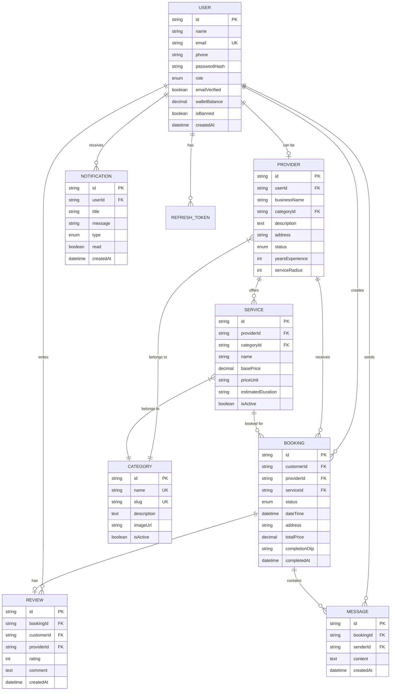
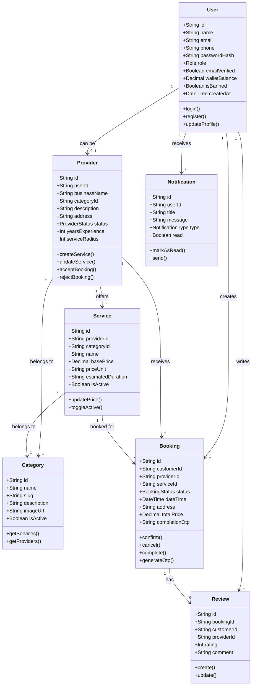
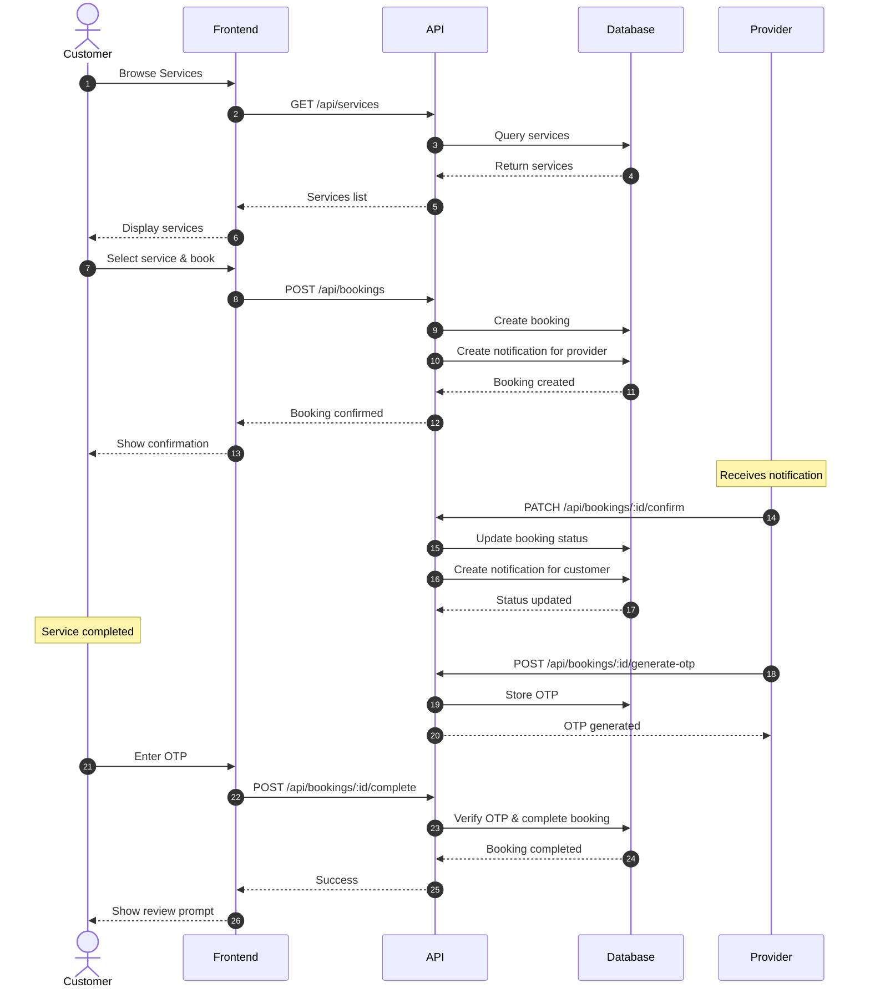
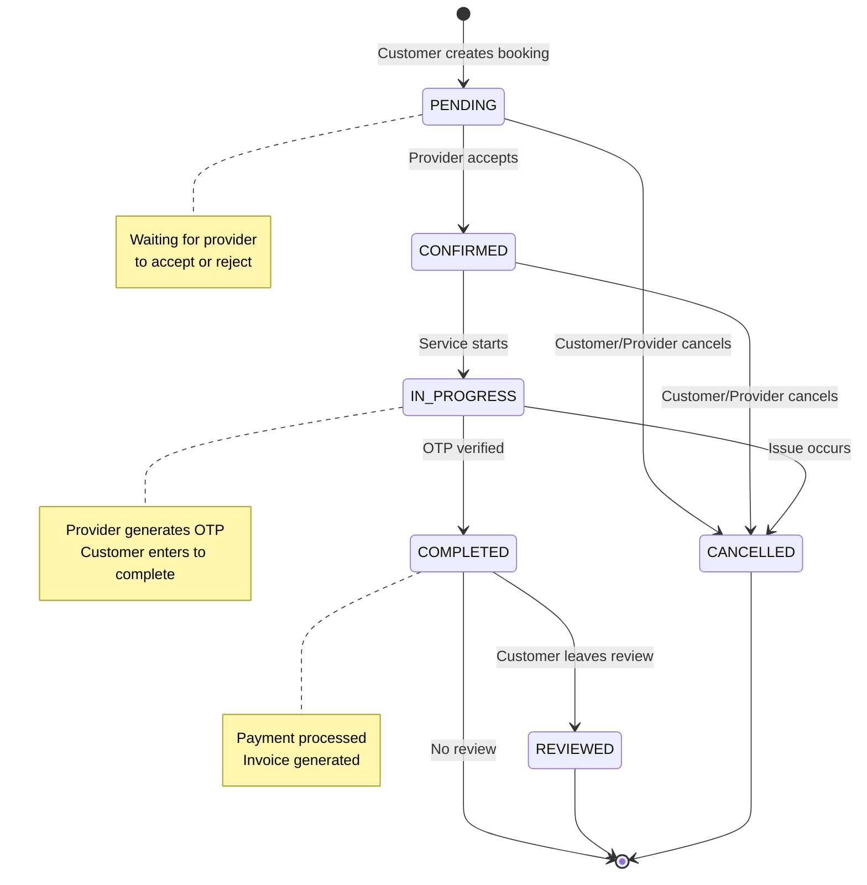
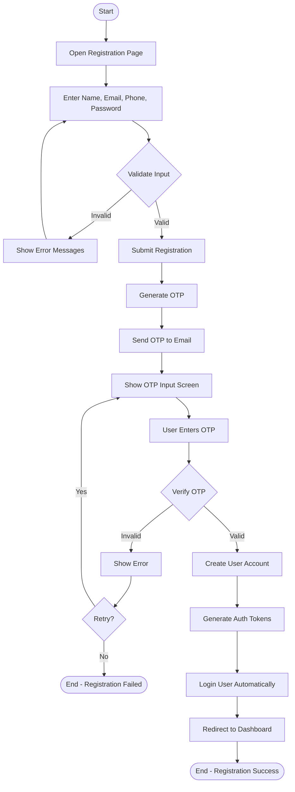
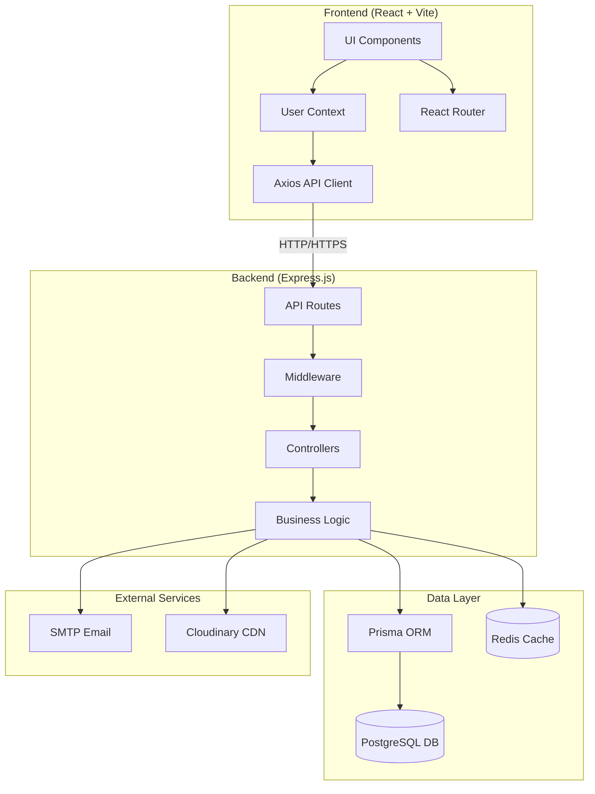

# MH26 Services - UML Diagrams (Mermaid)

This document contains 7 UML diagrams for the MH26 Services platform in Mermaid syntax.
Copy these into StarUML or any Mermaid-compatible tool to render them.

---

## 1. Entity Relationship Diagram (ERD)



---

## 2. Class Diagram



---

## 3. Sequence Diagram - Booking Flow



---

## 4. Use Case Diagram

```mermaid
flowchart TB
    subgraph Actors
        Customer((Customer))
        Provider((Provider))
        Admin((Admin))
    end
    
    subgraph "Customer Use Cases"
        UC1[Register/Login]
        UC2[Browse Services]
        UC3[Search Services]
        UC4[Book Service]
        UC5[Track Booking]
        UC6[Message Provider]
        UC7[Complete Booking with OTP]
        UC8[Leave Review]
        UC9[View Invoices]
    end
    
    subgraph "Provider Use Cases"
        UC10[Register as Provider]
        UC11[Manage Services]
        UC12[Accept/Reject Booking]
        UC13[Generate Completion OTP]
        UC14[View Earnings]
        UC15[Respond to Reviews]
    end
    
    subgraph "Admin Use Cases"
        UC16[Manage Users]
        UC17[Approve Providers]
        UC18[Manage Categories]
        UC19[View Analytics]
        UC20[Ban/Unban Users]
        UC21[Handle Appeals]
    end
    
    Customer --> UC1
    Customer --> UC2
    Customer --> UC3
    Customer --> UC4
    Customer --> UC5
    Customer --> UC6
    Customer --> UC7
    Customer --> UC8
    Customer --> UC9
    
    Provider --> UC10
    Provider --> UC11
    Provider --> UC12
    Provider --> UC13
    Provider --> UC14
    Provider --> UC15
    
    Admin --> UC16
    Admin --> UC17
    Admin --> UC18
    Admin --> UC19
    Admin --> UC20
    Admin --> UC21
```



---

## 5. State Diagram - Booking Status



---

## 6. Activity Diagram - User Registration



---

## 7. Component Diagram



---

## How to Use in StarUML

1. **Copy** the Mermaid code block (without the ``` markers)
2. **Open StarUML** and create a new project
3. Go to **Tools → Extensions → Install Mermaid Import** (if available)
4. **Or** use [Mermaid Live Editor](https://mermaid.live/) to export as PNG/SVG
5. **Import** the image into StarUML as a reference diagram

Alternatively, you can manually recreate these diagrams in StarUML using the structure shown in the Mermaid syntax as a guide.
