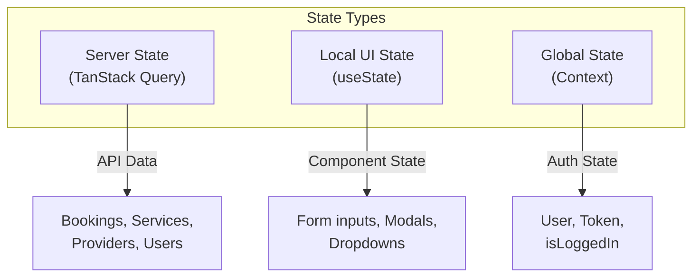
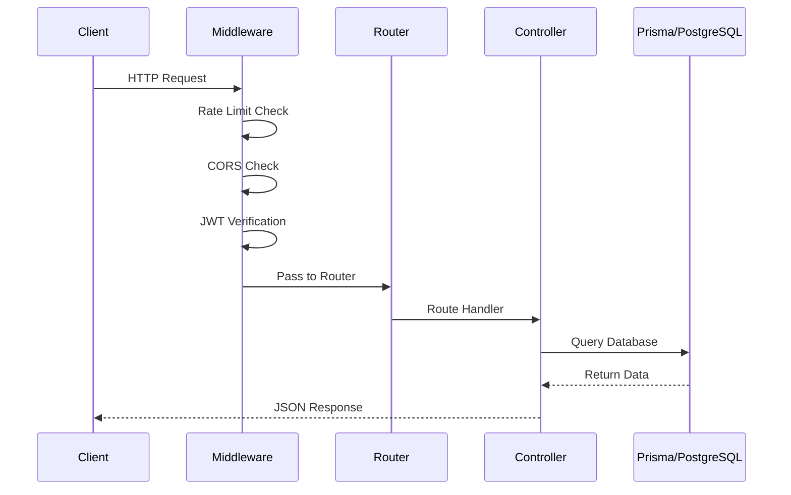
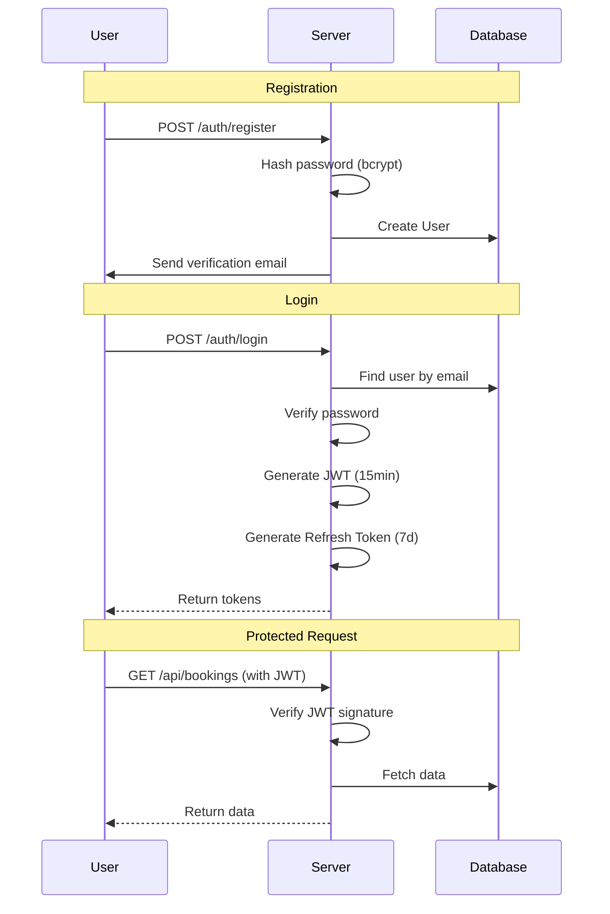
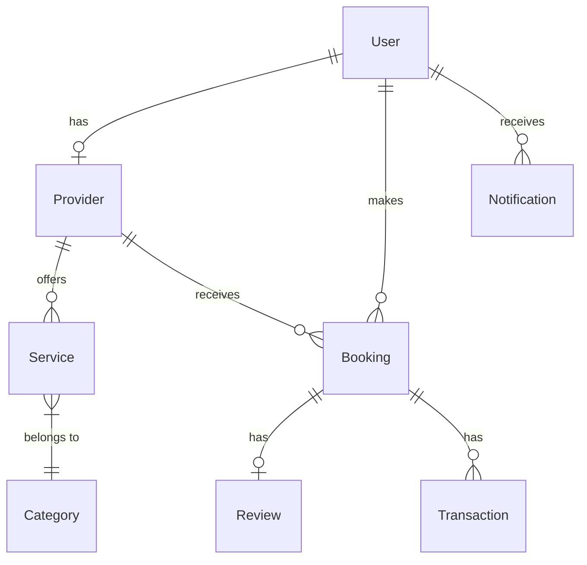
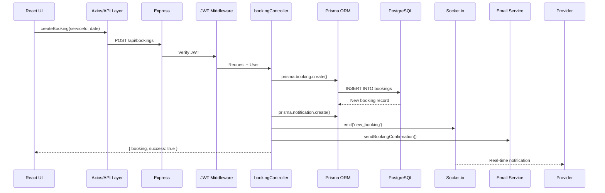
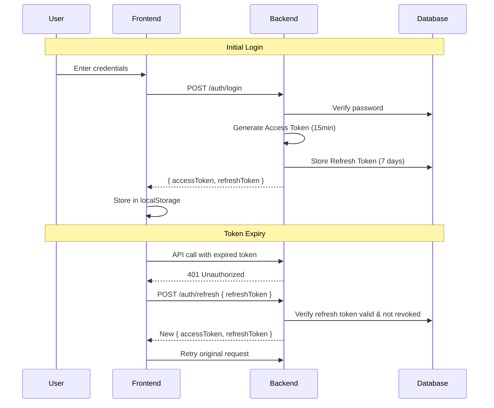
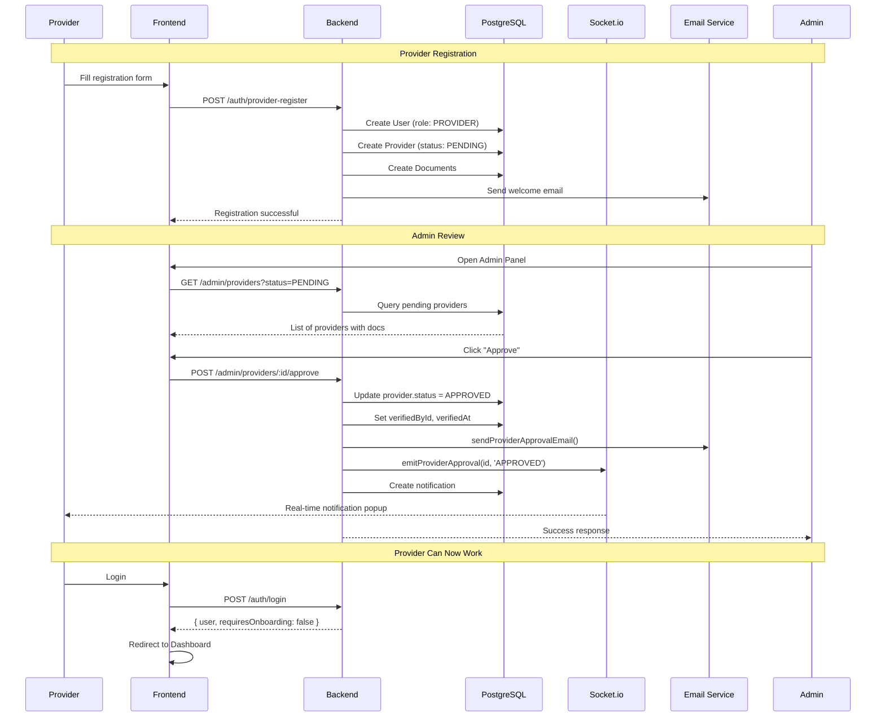
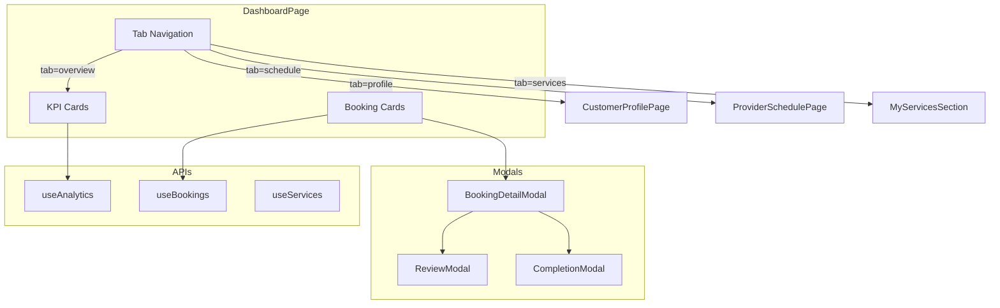
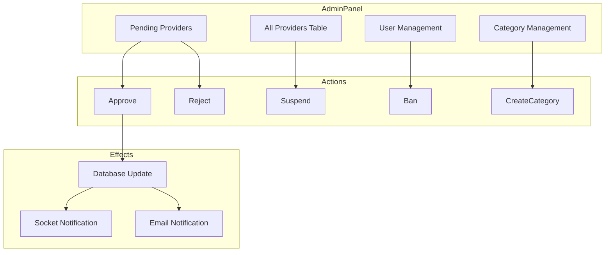

# MH26 Services - Comprehensive Technical Audit

## Executive Summary
MH26 Services is a full-stack service marketplace platform connecting service providers with customers. Built with modern technologies following industry best practices.

---

# PART 1: FRONTEND ARCHITECTURE

## 1.1 Technology Stack

| Technology | Version | Purpose |
|------------|---------|---------|
| **React** | 18.2.0 | UI Library |
| **TypeScript** | 5.2.2 | Type Safety |
| **Vite** | 5.0.8 | Build Tool |
| **TanStack Query** | 5.17.0 | Server State Management |
| **React Router** | 6.21.1 | Client-Side Routing |
| **Tailwind CSS** | 3.4.18 | Styling |
| **Radix UI** | Latest | Accessible Components |
| **Axios** | 1.6.2 | HTTP Client |
| **Socket.io Client** | 4.6.1 | Real-time Communication |
| **Zod** | 3.22.4 | Runtime Validation |

---

## 1.2 Why This Stack? (vs Alternatives)

### React vs Vue vs Angular

| Criteria | React ✓ | Vue | Angular |
|----------|---------|-----|---------|
| **Learning Curve** | Moderate | Easy | Steep |
| **Ecosystem** | Massive | Growing | Large |
| **Performance** | Excellent | Excellent | Good |
| **Flexibility** | High | Medium | Low |
| **Jobs/Community** | #1 | #3 | #2 |

**Decision:** React chosen for:
- Largest ecosystem and community support
- Component-based architecture perfect for service cards, modals
- Hooks provide clean state management
- Better TypeScript integration
- More third-party libraries (Radix, TanStack)

### Vite vs Create React App vs Next.js

| Criteria | Vite ✓ | CRA | Next.js |
|----------|--------|-----|---------|
| **Dev Server Speed** | <300ms | 20-30s | ~5s |
| **HMR** | Instant | Slow | Fast |
| **Bundle Size** | Smallest | Large | Medium |
| **SSR** | Optional | No | Built-in |
| **Complexity** | Low | Low | Medium |

**Decision:** Vite chosen for:
- **10x faster** development builds via ESM
- Native TypeScript support
- Smaller production bundles (tree-shaking)
- No SSR needed for this SPA

### TanStack Query vs Redux vs Zustand

| Criteria | TanStack Query ✓ | Redux | Zustand |
|----------|------------------|-------|---------|
| **Server State** | ✓ Built-in | Manual | Manual |
| **Caching** | ✓ Automatic | Manual | Manual |
| **Boilerplate** | Minimal | Heavy | Minimal |
| **Devtools** | Excellent | Excellent | Basic |

**Decision:** TanStack Query chosen for:
- **Automatic caching** and background refetching
- Built-in loading/error states
- Optimistic updates
- Perfect for API-heavy apps

### Tailwind CSS vs CSS Modules vs Styled Components

| Criteria | Tailwind ✓ | CSS Modules | Styled Components |
|----------|-----------|-------------|-------------------|
| **Speed** | Fastest | Medium | Slowest |
| **Bundle Size** | Smallest | Medium | Largest |
| **Learning** | New syntax | Standard CSS | JS-in-CSS |
| **Consistency** | Design system | Manual | Manual |

**Decision:** Tailwind chosen for:
- Utility-first approach = rapid development
- Design system via tailwind.config.js
- Purging removes unused CSS (tiny bundles)
- Consistent spacing, colors, responsive design

---

## 1.3 Frontend Architecture

```
frontend/
├── src/
│   ├── api/              # API layer (axios + TanStack Query hooks)
│   │   ├── admin.ts      # Admin API calls
│   │   ├── auth.ts       # Authentication API
│   │   ├── bookings.ts   # Booking CRUD
│   │   ├── categories.ts # Categories API
│   │   ├── providers.ts  # Provider API
│   │   ├── services.ts   # Services API
│   │   └── axiosClient.ts # Configured Axios instance
│   │
│   ├── components/       # React Components
│   │   ├── ui/           # Reusable UI primitives (56 components)
│   │   ├── AdminPanel.tsx
│   │   ├── AuthPage.tsx
│   │   ├── DashboardPage.tsx
│   │   ├── HomePage.tsx
│   │   └── ... (48 components total)
│   │
│   ├── context/          # React Context Providers
│   │   ├── UserContext.tsx    # User authentication state
│   │   └── NotificationContext.tsx
│   │
│   ├── hooks/            # Custom React Hooks
│   ├── lib/              # Utility functions
│   └── main.tsx          # Entry point
```

---

## 1.4 Component Design Patterns

### Pattern 1: Container/Presentational Split
```tsx
// Container: DashboardPage.tsx (handles data fetching)
const { data: analytics } = useAnalytics();
const { data: bookings } = useBookings();

// Presentational: Renders UI with props
<StatCard title="Revenue" value={analytics.revenue} />
```

### Pattern 2: Custom Hooks for API Calls
```tsx
// api/bookings.ts
export function useBookings(filters?: BookingFilters) {
  return useQuery({
    queryKey: ['bookings', filters],
    queryFn: () => bookingsApi.getBookings(filters)
  });
}

// Usage in component
const { data, isLoading, error } = useBookings({ status: 'PENDING' });
```

### Pattern 3: Mutation with Optimistic Updates
```tsx
export function useCreateService() {
  const queryClient = useQueryClient();
  return useMutation({
    mutationFn: servicesApi.create,
    onSuccess: () => {
      queryClient.invalidateQueries({ queryKey: ['services'] });
    }
  });
}
```

---

## 1.5 State Management Strategy



---

## 1.6 API Integration Pattern

```tsx
// axiosClient.ts - Centralized configuration
const axiosClient = axios.create({
  baseURL: '/api',
  headers: { 'Content-Type': 'application/json' }
});

// Request interceptor - adds auth token
axiosClient.interceptors.request.use((config) => {
  const token = localStorage.getItem('token');
  if (token) config.headers.Authorization = `Bearer ${token}`;
  return config;
});

// Response interceptor - handles 401
axiosClient.interceptors.response.use(
  response => response,
  error => {
    if (error.response?.status === 401) {
      // Redirect to login
    }
    return Promise.reject(error);
  }
);
```

---

# PART 2: BACKEND ARCHITECTURE

## 2.1 Technology Stack

| Technology | Version | Purpose |
|------------|---------|---------|
| **Node.js** | 20.x | Runtime |
| **Express** | 4.18.2 | Web Framework |
| **TypeScript** | 5.3.2 | Type Safety |
| **Prisma** | 5.22.0 | ORM |
| **PostgreSQL** | 15.x | Database |
| **Socket.io** | 4.5.4 | WebSockets |
| **JWT** | 9.0.2 | Authentication |
| **Bcrypt** | 5.1.1 | Password Hashing |
| **Winston** | 3.11.0 | Logging |
| **Zod** | 3.22.4 | Validation |

---

## 2.2 Why This Stack?

### Express vs Fastify vs NestJS

| Criteria | Express ✓ | Fastify | NestJS |
|----------|-----------|---------|--------|
| **Maturity** | 10+ years | 5 years | 6 years |
| **Performance** | Good | Best | Good |
| **Ecosystem** | Massive | Growing | Large |
| **Learning** | Easy | Easy | Moderate |
| **Flexibility** | Maximum | High | Opinionated |

**Decision:** Express chosen for:
- Most mature Node.js framework
- Largest middleware ecosystem
- Team familiarity
- Simple to understand and debug

### Prisma vs TypeORM vs Sequelize

| Criteria | Prisma ✓ | TypeORM | Sequelize |
|----------|----------|---------|-----------|
| **Type Safety** | ✓ Auto-generated | Manual | None |
| **Migrations** | ✓ Automatic | Manual | Manual |
| **Schema** | ✓ Declarative | Code | Code |
| **DevX** | Best | Good | Moderate |
| **Studio** | ✓ Built-in | No | No |

**Decision:** Prisma chosen for:
- **Auto-generated TypeScript types** from schema
- Declarative schema = single source of truth
- Prisma Studio for visual DB management
- Excellent migration system

---

## 2.3 Backend Architecture

```
server/
├── src/
│   ├── controllers/      # Request handlers
│   │   ├── adminController.ts     (34KB - largest)
│   │   ├── authController.ts      (22KB)
│   │   ├── providerController.ts
│   │   ├── bookingController.ts
│   │   └── ... (11 controllers)
│   │
│   ├── routes/           # Express routers
│   │   ├── auth.ts
│   │   ├── bookings.ts
│   │   └── ...
│   │
│   ├── middleware/       # Express middleware
│   │   ├── auth.ts       # JWT verification
│   │   ├── errorHandler.ts
│   │   └── validation.ts
│   │
│   ├── services/         # Business logic
│   │   ├── emailService.ts
│   │   └── socketService.ts
│   │
│   └── index.ts          # Entry point
│
├── prisma/
│   ├── schema.prisma     # Database schema
│   ├── migrations/       # SQL migrations
│   └── seed.ts           # Seed data
```

---

## 2.4 Request Flow



---

## 2.5 Authentication Flow



---

# PART 3: DATABASE DESIGN

## 3.1 Why PostgreSQL?

### PostgreSQL vs MySQL vs MongoDB

| Criteria | PostgreSQL ✓ | MySQL | MongoDB |
|----------|--------------|-------|---------|
| **ACID Compliance** | ✓ Full | Full | Partial |
| **JSON Support** | ✓ Native (JSONB) | JSON type | Native |
| **Full-Text Search** | ✓ Built-in | Basic | Atlas only |
| **Geographic** | ✓ PostGIS | Limited | Geospatial |
| **Complex Queries** | Excellent | Good | Aggregation |
| **Scalability** | Excellent | Excellent | Excellent |
| **Data Integrity** | ✓ Strict | Strict | Flexible |

**Decision:** PostgreSQL chosen for:

1. **JSONB Support** - Storing `availability` as JSON:
   ```sql
   availability JSONB
   -- Stores: {"monday": {"enabled": true, "start": "09:00", "end": "18:00"}}
   ```

2. **Strong ACID** - Financial transactions need atomicity:
   ```sql
   -- Booking creation is atomic
   BEGIN;
     UPDATE users SET wallet_balance = wallet_balance - 500;
     INSERT INTO bookings (...) VALUES (...);
     INSERT INTO transactions (...) VALUES (...);
   COMMIT;
   ```

3. **Advanced Indexing**:
   ```sql
   @@index([city, primaryCategory])  -- Composite for provider search
   @@index([lat, lng])               -- Geographic queries
   ```

4. **Prisma Integration** - Best ORM support for PostgreSQL

---

## 3.2 Database Schema Overview

### Core Entities



### Key Models

| Model | Purpose | Key Fields |
|-------|---------|------------|
| **User** | All users | `role` (CUSTOMER/PROVIDER/ADMIN) |
| **Provider** | Service providers | `status`, `availability`, `serviceRadius` |
| **Service** | Offered services | `price`, `durationMin`, `status` |
| **Booking** | Transactions | `status`, `totalAmount`, `scheduledAt` |
| **Review** | Ratings | `rating`, `comment` |
| **Transaction** | Payments | `type`, `amount`, `status` |

---

## 3.3 Schema Design Decisions

### 1. UUID vs Auto-Increment IDs
```prisma
id String @id @default(uuid())
```
**Why UUID:**
- No sequential exposure (security)
- Distributed ID generation
- URL-friendly

### 2. Soft Deletes via Status
```prisma
status ProviderStatus @default(PENDING)
// PENDING | APPROVED | REJECTED | SUSPENDED
```
**Why:** Never delete data, change status for audit trail

### 3. Denormalization for Performance
```prisma
// User stores totalSpending (calculated)
totalSpending Decimal @default(0)

// Provider stores averageRating (calculated)
averageRating Float? @default(0)
totalRatings  Int    @default(0)
```
**Why:** Avoid expensive JOINs for common queries

### 4. JSON for Flexible Data
```prisma
availability     Json?    // Weekly schedule
socialMediaLinks Json?    // Dynamic social links
```
**Why:** Schema-less within structured database

---

## 3.4 Indexes for Performance

```prisma
// User lookups
@@index([email])          // Login
@@index([phone])          // OTP verification
@@index([role])           // Admin filtering

// Provider search
@@index([city, primaryCategory])  // Location + category
@@index([status])                 // Admin approval queue
@@index([lat, lng])               // Geographic proximity

// Booking queries
@@index([userId])         // User's bookings
@@index([providerId])     // Provider's bookings
@@index([status])         // Filter by status
@@index([scheduledAt])    // Calendar view
```

---

## 3.5 Relationships

```prisma
// One-to-One: User <-> Provider
model User {
  provider Provider?
}
model Provider {
  userId String @unique
  user   User   @relation(fields: [userId], references: [id])
}

// One-to-Many: Provider -> Services
model Provider {
  services Service[]
}
model Service {
  providerId String
  provider   Provider @relation(fields: [providerId], references: [id])
}

// Many-to-Many: User <-> SavedProvider (via junction)
model SavedProvider {
  userId     String
  providerId String
  @@id([userId, providerId])
}
```

---

# PART 4: DATA FLOW

## 4.1 Complete Request Flow Example

**Scenario: Customer books a service**



---

## 4.2 State Synchronization

```mermaid
flowchart TB
    subgraph Frontend
        TQ[TanStack Query Cache]
        UI[React Components]
    end
    
    subgraph Backend
        API[Express API]
        WS[Socket.io]
    end
    
    subgraph Database
        PG[(PostgreSQL)]
    end
    
    UI -->|mutate()| TQ
    TQ -->|HTTP Request| API
    API -->|Prisma Query| PG
    PG -->|Response| API
    API -->|JSON Response| TQ
    TQ -->|Re-render| UI
    
    API -->|Emit Event| WS
    WS -->|Push Update| TQ
    TQ -->|invalidateQueries()| UI
```

---

# PART 5: BEST PRACTICES

## 5.1 Frontend Best Practices

| Practice | Implementation |
|----------|----------------|
| **Type Safety** | TypeScript + Zod validation |
| **Code Splitting** | React.lazy() for routes |
| **Error Boundaries** | ErrorBoundary.tsx wraps app |
| **Accessibility** | Radix UI primitives (ARIA) |
| **Responsive** | Tailwind responsive prefixes |
| **Loading States** | isLoading from TanStack Query |
| **Optimistic Updates** | useMutation onMutate |
| **Form Validation** | react-hook-form + zod |

## 5.2 Backend Best Practices

| Practice | Implementation |
|----------|----------------|
| **Input Validation** | Zod schemas + express-validator |
| **Authentication** | JWT with refresh tokens |
| **Authorization** | Role-based middleware |
| **Rate Limiting** | express-rate-limit |
| **Security Headers** | Helmet.js |
| **Error Handling** | Centralized AppError class |
| **Logging** | Winston (structured JSON) |
| **Password Security** | Bcrypt (12 rounds) |

## 5.3 Database Best Practices

| Practice | Implementation |
|----------|----------------|
| **Migrations** | Prisma migrate |
| **Seeding** | prisma/seed.ts |
| **Indexing** | Composite indexes for common queries |
| **Transactions** | Prisma $transaction() |
| **Soft Deletes** | Status fields, never DELETE |
| **Audit Trail** | AuditLog model |
| **Normalization** | 3NF with strategic denorm |
| **Constraints** | @unique, foreign keys |

---

# PART 6: SUMMARY

## Technology Justifications

| Layer | Choice | Key Reason |
|-------|--------|------------|
| **Frontend** | React + TypeScript | Type safety + ecosystem |
| **Build** | Vite | 10x faster dev builds |
| **State** | TanStack Query | Server state caching |
| **Styling** | Tailwind | Rapid, consistent design |
| **UI** | Radix | Accessible primitives |
| **Backend** | Express | Mature, flexible |
| **ORM** | Prisma | Type-safe, migrations |
| **Database** | PostgreSQL | JSONB, ACID, indexes |
| **Auth** | JWT | Stateless, scalable |
| **Real-time** | Socket.io | Cross-browser WebSockets |

## Files Changed in This Session

| Component | Files |
|-----------|-------|
| Frontend | 48 components, 7 API modules |
| Backend | 11 controllers, 6 route files |
| Database | 15+ models in schema.prisma |

---

*Generated for MH26 Services demo presentation*

---

# PART 7: PROBLEM-SOLUTION DEEP DIVE

This section explains **WHY** specific technologies were introduced when facing specific problems during development.

---

## 7.1 Real-Time Notifications (Socket.io)

### ❌ THE PROBLEM

```
SCENARIO: Provider receives a new booking from a customer

Without real-time:
1. Provider must manually refresh dashboard to see new bookings
2. Provider might miss urgent bookings
3. Customer waits for provider response (poor UX)
4. Polling every 5 seconds = 12 requests/minute = 17,280 requests/day per user
   (This kills server performance and wastes bandwidth)
```

### ✅ THE SOLUTION: Socket.io

```
WHY Socket.io instead of alternatives?

| Technology | Problem |
|------------|---------|
| **HTTP Polling** | ❌ Too many requests, high latency |
| **Long Polling** | ❌ Complex connection management |
| **Server-Sent Events** | ❌ One-way only (server→client), no bidirectional |
| **Raw WebSockets** | ❌ No fallback for old browsers, manual reconnection |
| **Socket.io** ✓ | ✓ Bidirectional, auto-reconnect, fallback to polling |
```

### Implementation

**Backend (socketService.ts):**
```typescript
// Initialize Socket.io with Express server
const io = new Server(httpServer, {
  cors: { origin: process.env.FRONTEND_URL }
});

// Authentication middleware
io.use((socket, next) => {
  const token = socket.handshake.auth.token;
  try {
    const decoded = jwt.verify(token, process.env.JWT_SECRET!);
    socket.data.userId = decoded.sub;
    next();
  } catch (err) {
    next(new Error('Authentication failed'));
  }
});

// Emit notification to specific user
export function emitNotification(userId: string, notification: any) {
  io.to(`user:${userId}`).emit('notification', notification);
}
```

**Frontend (UserSocketSync.tsx):**
```tsx
useEffect(() => {
  const socket = io(API_URL, {
    auth: { token: localStorage.getItem('token') }
  });

  socket.on('notification', (data) => {
    queryClient.invalidateQueries({ queryKey: ['notifications'] });
    toast.info(data.message);
  });

  socket.on('booking_update', (data) => {
    queryClient.invalidateQueries({ queryKey: ['bookings'] });
  });

  return () => socket.disconnect();
}, []);
```

### Real-Time Events in MH26

| Event | Trigger | Recipients |
|-------|---------|------------|
| `new_booking` | Customer creates booking | Provider |
| `booking_accepted` | Provider accepts | Customer |
| `booking_rejected` | Provider rejects | Customer |
| `provider_approved` | Admin approves provider | Provider |
| `new_message` | User sends message | Other user |

---

## 7.2 Authentication System (JWT + Refresh Tokens)

### ❌ THE PROBLEM

```
SCENARIO: User sessions need to be secure yet user-friendly

Problems with session-based auth:
1. Sessions stored in server memory = doesn't scale
2. Session files on disk = I/O bottleneck
3. Redis session store = additional infrastructure
4. User must re-login every time session expires
```

### ✅ THE SOLUTION: JWT + Refresh Tokens

```
WHY JWT?
- Stateless: No server-side session storage
- Scalable: Multiple servers can verify tokens independently
- Mobile-friendly: Works perfectly with React Native

WHY Short-lived Access Token + Long Refresh Token?
- Access Token (15 min): If stolen, limited damage
- Refresh Token (7 days): Stored in DB, can be revoked
```

### Token Flow



### Security Measures

```typescript
// Password hashing with bcrypt (12 rounds)
const hashedPassword = await bcrypt.hash(password, 12);
// 12 rounds = ~250ms to hash, prevents brute force

// JWT configuration
const accessToken = jwt.sign(
  { sub: user.id, role: user.role },
  process.env.JWT_SECRET!,
  { expiresIn: '15m' }  // Short-lived
);

// Refresh token stored in DB (can be revoked)
await prisma.refreshToken.create({
  data: {
    token: refreshToken,
    userId: user.id,
    expiresAt: new Date(Date.now() + 7 * 24 * 60 * 60 * 1000)
  }
});
```

---

## 7.3 Email Notifications (Nodemailer + Resend)

### ❌ THE PROBLEM

```
SCENARIO: Provider application approved - how to notify them?

Problems:
1. User might not be logged in
2. Push notifications require app installation
3. SMS is expensive for every notification
4. Email is universal and expected
```

### ✅ THE SOLUTION: Email via Resend API

```
WHY Resend over alternatives?

| Service | Problem |
|---------|---------|
| **Gmail SMTP** | ❌ 500 emails/day limit, auth issues |
| **SendGrid** | ❌ Complex setup, expensive |
| **AWS SES** | ❌ Requires AWS account, sandbox mode |
| **Resend** ✓ | ✓ Simple API, 3000 free emails/month |
```

### Implementation

```typescript
// emailService.ts
import { Resend } from 'resend';

const resend = new Resend(process.env.RESEND_API_KEY);

export async function sendProviderApprovalEmail(
  email: string,
  businessName: string,
  approved: boolean,
  reason?: string
) {
  const subject = approved 
    ? '🎉 Your Provider Application is Approved!'
    : '❌ Provider Application Status Update';

  const html = approved
    ? `<h1>Congratulations!</h1>
       <p>Your business "${businessName}" has been approved.</p>
       <p>You can now start receiving bookings.</p>
       <a href="${process.env.FRONTEND_URL}/dashboard">Go to Dashboard</a>`
    : `<h1>Application Update</h1>
       <p>Your application for "${businessName}" was not approved.</p>
       <p>Reason: ${reason}</p>
       <p>You can reapply after addressing the issues.</p>`;

  await resend.emails.send({
    from: 'MH26 Services <noreply@mh26.com>',
    to: email,
    subject,
    html
  });
}
```

### Email Triggers

| Event | Email Sent | Recipient |
|-------|------------|-----------|
| Registration | Verification link | New user |
| Provider approved | Welcome + next steps | Provider |
| Provider rejected | Reason + reapply instructions | Provider |
| Booking created | Confirmation details | Customer + Provider |
| Booking completed | Invoice + review request | Customer |
| Password reset | Reset link | User |

---

## 7.4 Form Validation (Zod + React Hook Form)

### ❌ THE PROBLEM

```
SCENARIO: Provider registration form with many fields

Problems:
1. Client-side validation only = security hole
2. Server-side only = poor UX (submit then error)
3. Different validation logic = inconsistency
4. TypeScript types ≠ runtime validation
```

### ✅ THE SOLUTION: Zod (Shared Schema)

```
WHY Zod?

1. Single schema defines:
   - TypeScript types (compile-time)
   - Runtime validation (server)
   - Form validation (client)

2. Same validation runs everywhere
3. Type inference = no duplicate definitions
```

### Shared Schema Pattern

```typescript
// shared/schemas.ts (used by both frontend and backend)
import { z } from 'zod';

export const providerRegistrationSchema = z.object({
  businessName: z.string()
    .min(3, 'Business name must be at least 3 characters')
    .max(100, 'Business name too long'),
  
  email: z.string()
    .email('Invalid email format'),
  
  phone: z.string()
    .regex(/^[6-9]\d{9}$/, 'Invalid Indian phone number'),
  
  category: z.string()
    .min(1, 'Please select a category'),
  
  serviceRadius: z.number()
    .min(1, 'Minimum 1 km')
    .max(50, 'Maximum 50 km'),
});

// Type inference - no manual typing needed!
export type ProviderRegistration = z.infer<typeof providerRegistrationSchema>;
```

**Frontend (react-hook-form integration):**
```tsx
import { useForm } from 'react-hook-form';
import { zodResolver } from '@hookform/resolvers/zod';
import { providerRegistrationSchema, ProviderRegistration } from '@/schemas';

function ProviderForm() {
  const form = useForm<ProviderRegistration>({
    resolver: zodResolver(providerRegistrationSchema),
    defaultValues: { serviceRadius: 10 }
  });

  // Validation runs automatically on blur/submit
  // Errors display inline with correct types
}
```

**Backend (Express middleware):**
```typescript
// middleware/validation.ts
export function validate(schema: z.ZodSchema) {
  return (req: Request, res: Response, next: NextFunction) => {
    const result = schema.safeParse(req.body);
    if (!result.success) {
      return res.status(400).json({ 
        errors: result.error.flatten().fieldErrors 
      });
    }
    req.body = result.data; // Typed and validated!
    next();
  };
}

// Usage in route
router.post('/providers', 
  validate(providerRegistrationSchema),
  providerController.create
);
```

---

## 7.5 State Management Strategy

### ❌ THE PROBLEM

```
SCENARIO: Managing different types of state

Types of state in MH26:
1. Server State: Bookings, providers, services (from API)
2. UI State: Modal open/closed, form inputs
3. Global State: Current user, theme

Problems with Redux for everything:
- Too much boilerplate for simple UI state
- Manual cache management for API data
- Stale data issues when multiple components fetch same data
```

### ✅ THE SOLUTION: Layered State Management

```
| State Type | Solution | Why |
|------------|----------|-----|
| Server State | TanStack Query | Automatic caching, refetching |
| UI State | useState | Simple, component-scoped |
| Global State | React Context | Prop drilling avoidance |
```

### TanStack Query Benefits

```tsx
// WITHOUT TanStack Query (manual approach)
function BookingsPage() {
  const [bookings, setBookings] = useState([]);
  const [loading, setLoading] = useState(true);
  const [error, setError] = useState(null);

  useEffect(() => {
    setLoading(true);
    fetch('/api/bookings')
      .then(res => res.json())
      .then(data => setBookings(data))
      .catch(err => setError(err))
      .finally(() => setLoading(false));
  }, []);

  // Problems:
  // - No caching (refetches on every mount)
  // - No background updates
  // - Manual loading/error state
}

// WITH TanStack Query
function BookingsPage() {
  const { data, isLoading, error } = useBookings();
  
  // Benefits:
  // ✓ Automatic caching (5 min default)
  // ✓ Background refetch when window focused
  // ✓ Shared cache across components
  // ✓ Built-in loading/error states
  // ✓ Optimistic updates via useMutation
}
```

---

## 7.6 File Upload Strategy

### ❌ THE PROBLEM

```
SCENARIO: Provider uploads business documents

Problems:
1. Storing files in local filesystem:
   - Not scalable (single server)
   - Lost on server restart (containers)
   - No CDN benefits

2. Base64 in database:
   - Database bloat
   - Slow queries
   - No streaming
```

### ✅ THE SOLUTION: Cloud Storage URLs

```
For MH26, we use a hybrid approach:

1. Development: Local filesystem with serve
2. Production: Google Drive / Cloudinary URLs

Provider documents are stored as:
- businessCardUrl: String (Google Drive link)
- workSampleUrl: String (Google Drive link)  
- certificateUrl: String (optional PDF link)
```

### Implementation

```typescript
// providerController.ts
async create(req: Request, res: Response) {
  const { 
    businessCardUrl,  // Already a Google Drive URL
    workSampleUrl,
    certificateUrl
  } = req.body;

  // Store URLs directly - no file handling needed
  const provider = await prisma.provider.create({
    data: {
      // ... other fields
      documents: {
        create: [
          { type: 'BUSINESS_CARD', fileUrl: businessCardUrl },
          { type: 'WORK_SAMPLE', fileUrl: workSampleUrl },
          certificateUrl && { type: 'CERTIFICATE', fileUrl: certificateUrl }
        ].filter(Boolean)
      }
    }
  });
}
```

---

## 7.7 Rate Limiting & Security

### ❌ THE PROBLEM

```
SCENARIO: Protecting API from abuse

Attacks to prevent:
1. Brute force login attempts
2. DDoS overwhelming server
3. Scraping provider data
4. OTP spamming (SMS costs money!)
```

### ✅ THE SOLUTION: Multi-Layer Protection

```typescript
// 1. Rate Limiting (express-rate-limit)
const loginLimiter = rateLimit({
  windowMs: 15 * 60 * 1000, // 15 minutes
  max: 5, // 5 attempts per window
  message: 'Too many login attempts, try again in 15 minutes'
});

const otpLimiter = rateLimit({
  windowMs: 60 * 1000, // 1 minute
  max: 1, // 1 OTP per minute
  message: 'Please wait before requesting another OTP'
});

app.use('/auth/login', loginLimiter);
app.use('/auth/send-otp', otpLimiter);

// 2. Security Headers (Helmet)
app.use(helmet()); // Sets X-Frame-Options, CSP, etc.

// 3. CORS Configuration
app.use(cors({
  origin: process.env.FRONTEND_URL,
  credentials: true
}));

// 4. Input Sanitization (Zod)
// All inputs validated before reaching database
```

---

## 7.8 Database Transactions

### ❌ THE PROBLEM

```
SCENARIO: Creating a booking involves multiple operations

Operations needed:
1. Create booking record
2. Deduct from customer wallet
3. Create transaction record
4. Create notification
5. Send email

What if step 3 fails after step 2?
→ Money deducted but no transaction record = data corruption!
```

### ✅ THE SOLUTION: Prisma Transactions

```typescript
// bookingController.ts
async createBooking(req: Request, res: Response) {
  const { serviceId, scheduledAt, totalAmount } = req.body;
  const userId = req.user!.id;

  // All operations in single transaction
  const result = await prisma.$transaction(async (tx) => {
    // 1. Verify wallet balance
    const user = await tx.user.findUnique({ where: { id: userId } });
    if (Number(user!.walletBalance) < totalAmount) {
      throw new Error('Insufficient balance');
    }

    // 2. Deduct wallet balance
    await tx.user.update({
      where: { id: userId },
      data: { walletBalance: { decrement: totalAmount } }
    });

    // 3. Create booking
    const booking = await tx.booking.create({
      data: { userId, serviceId, scheduledAt, totalAmount, status: 'PENDING' }
    });

    // 4. Create transaction record
    await tx.transaction.create({
      data: {
        userId,
        bookingId: booking.id,
        amount: totalAmount,
        type: 'PAYMENT',
        status: 'COMPLETED'
      }
    });

    // 5. Create notification
    await tx.notification.create({
      data: {
        userId: service.provider.userId,
        type: 'NEW_BOOKING',
        message: `New booking from ${user!.name}`
      }
    });

    return booking;
  });

  // If ANY step fails, ALL changes are rolled back
  // Database remains consistent
}
```

---

## 7.9 Real-Time Provider Approval Flow

### Complete Flow Diagram



---

## 7.10 Custom Category Handling

### ❌ THE PROBLEM

```
SCENARIO: Provider enters "Tattoo Artist" as category

Problem:
- "Tattoo Artist" doesn't exist in predefined categories
- Admin needs to either:
  a) Create new "Tattoo Artist" category
  b) Assign to existing "Other" category
```

### ✅ THE SOLUTION: Admin Category Actions

```typescript
// adminController.ts
async approveProvider(req: Request, res: Response) {
  const { id } = req.params;
  const { category } = req.body; // Optional category override

  const updateData: any = { 
    status: 'APPROVED',
    verifiedById: req.user?.userId,
    verifiedAt: new Date(),
  };
  
  // If admin provided a category override, use it
  if (category) {
    updateData.primaryCategory = category;
  }

  const updated = await prisma.provider.update({
    where: { id },
    data: updateData,
  });
}
```

**Frontend shows action buttons for custom categories:**
```tsx
{isCustomCategory && (
  <div className="space-y-2">
    <div className="bg-amber-50 p-2 rounded-lg">
      <p>Custom Category: <strong>{provider.primaryCategory}</strong></p>
    </div>
    <div className="flex gap-2">
      <Button onClick={() => {
        // Create new category
        await createCategoryMutation.mutateAsync({
          name: provider.primaryCategory,
          slug: provider.primaryCategory.toLowerCase().replace(/\s+/g, '-'),
          icon: '📦',
        });
        // Then approve
        await handleApproveProvider(provider.id);
      }}>
        Create Category
      </Button>
      <Button onClick={() => handleApproveProvider(provider.id, 'Other')}>
        Assign to Other
      </Button>
    </div>
  </div>
)}
```

---

# PART 8: COMPONENT INTERACTION MAP

## 8.1 Dashboard Components



## 8.2 Admin Panel Flow



---

*End of Comprehensive Technical Audit*

