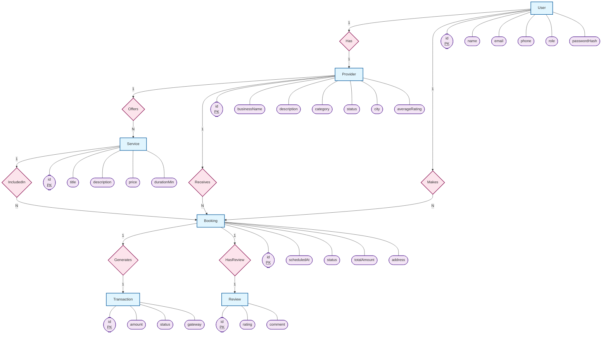

# Chen Notation ER Diagram (Visual Representation)

This diagram uses standard flowchart symbols to represent Chen Notation elements:
- **Rectangle**: Entity
- **Diamond**: Relationship
- **Oval (Stadium)**: Attribute
- **Lines**: Connections with Cardinality (1, N)

